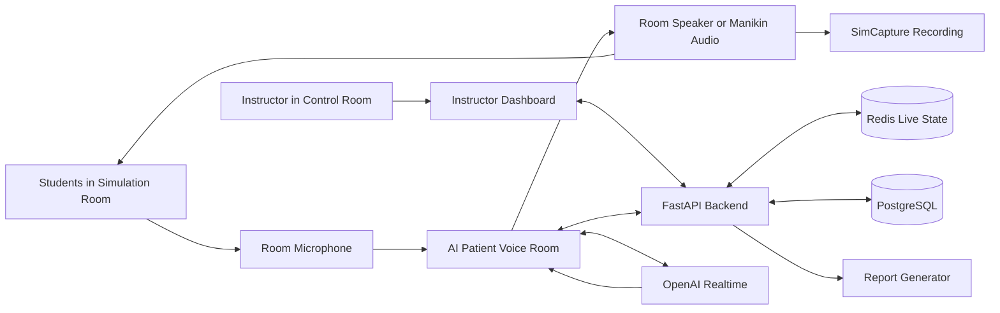
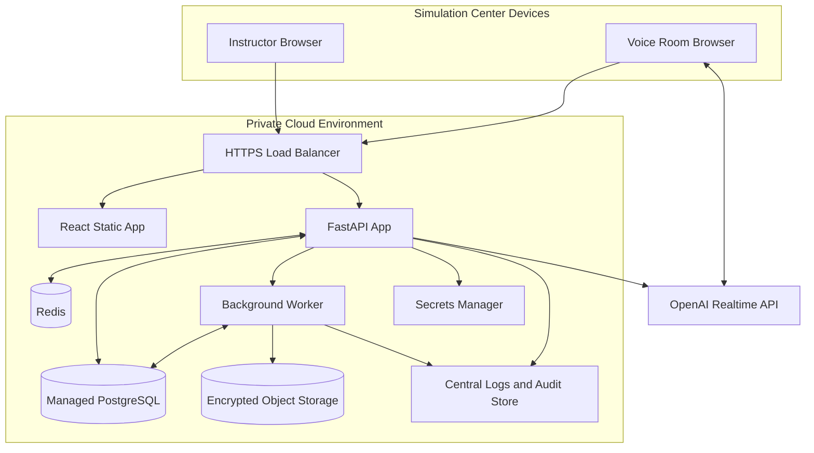
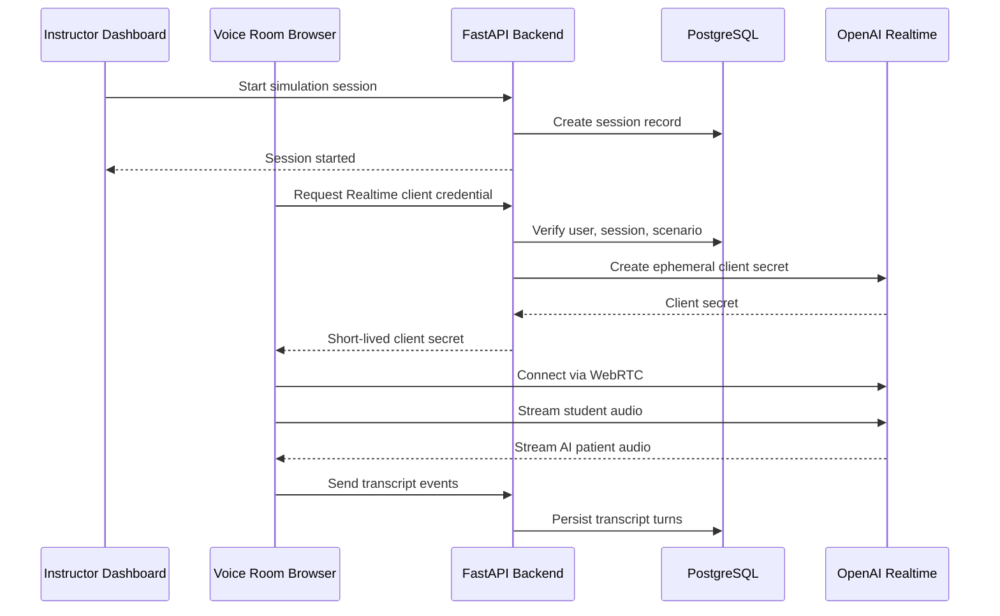
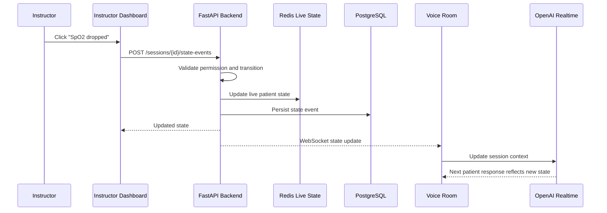
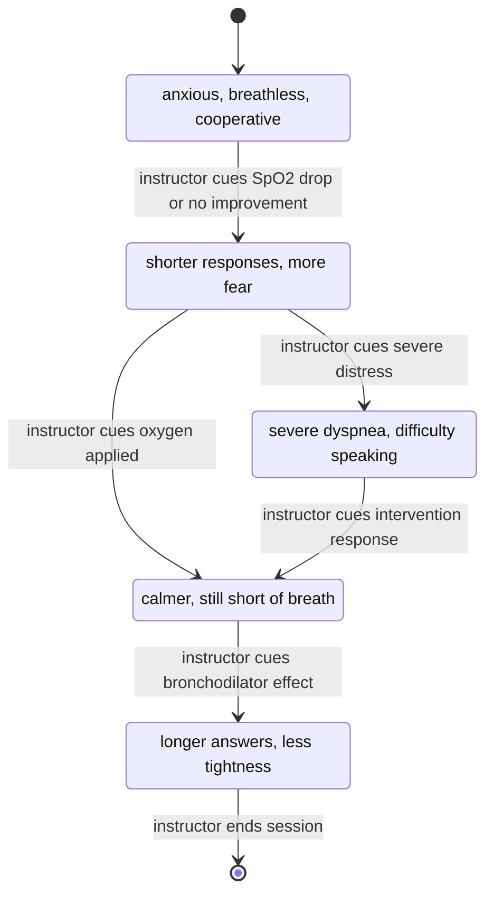
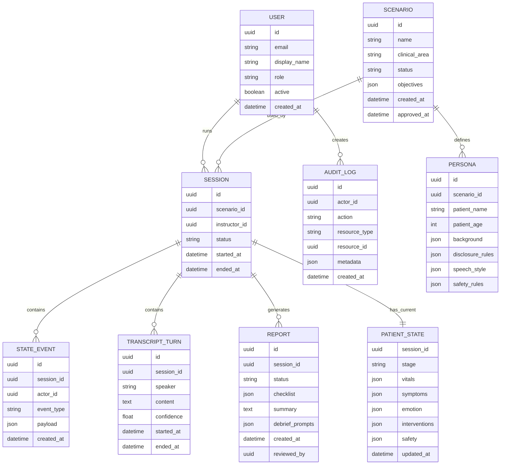
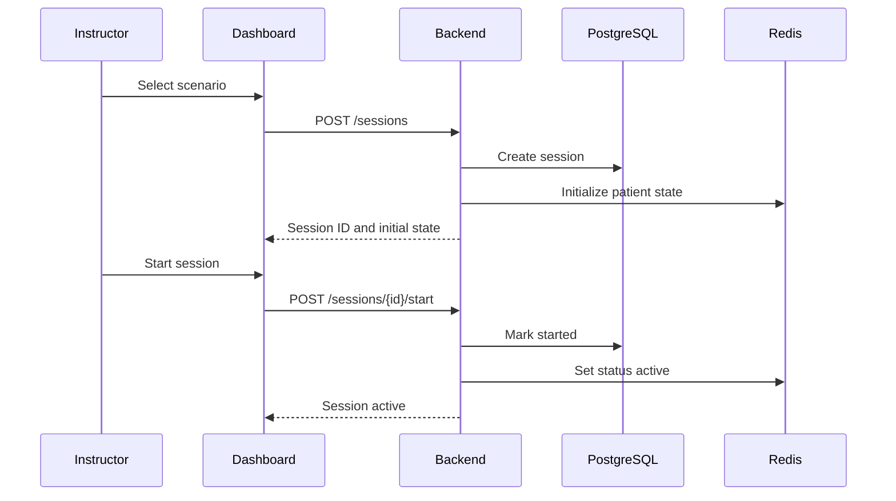
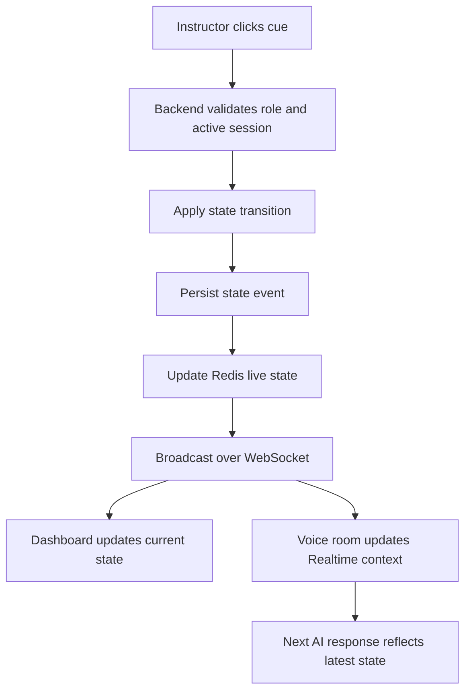
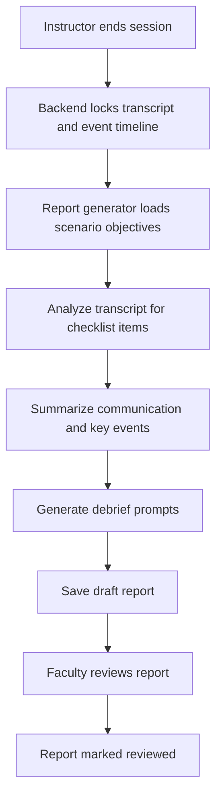
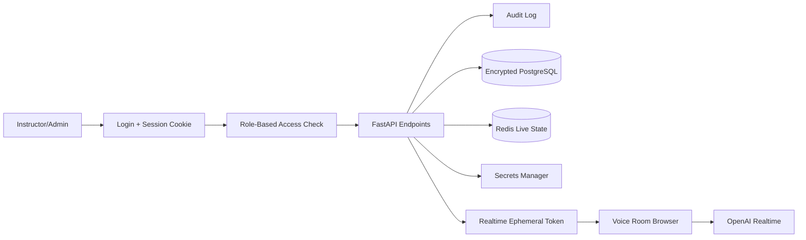

# AI Patient Voice Persona Implementation Design

**Document type:** Production implementation design  
**Product boundary:** Standalone instructor-cued AI patient voice system  
**Target users:** Nursing simulation faculty, simulation lab instructors, technical reviewers  
**Primary stack:** React + TypeScript, FastAPI, PostgreSQL, Redis, WebSockets, OpenAI Realtime  
**Important constraint:** No direct Laerdal/LLEAP/SimCapture integration is included in this design. The instructor manually controls the AI patient state through the AI dashboard.

---

## 1. Document Purpose

This document defines the production-grade implementation design for an instructor-cued AI patient voice system for nursing simulation. It describes the architecture, modules, data flow, diagrams, APIs, data model, security controls, report generation, testing plan, and rollout checklist.

The system is designed to run alongside an existing manikin simulation workflow. The instructor continues to control the manikin separately. The AI application provides a controlled patient voice, live transcript, event timeline, and debrief-ready report.

---

## 2. Product Overview

The product lets an instructor run an AI patient voice persona during a simulation scenario. Students speak to the simulated patient through a microphone in the simulation room. The AI responds as the patient using a scenario-specific persona and the current patient state. The instructor updates that state manually from a dashboard.

Example:

1. Instructor changes the manikin's heart rate in the existing manikin control software.
2. Instructor clicks `HR increased` in the AI dashboard.
3. The AI patient state updates.
4. The next AI patient response reflects the new condition.

The first production scenario is an adult COPD/shortness-of-breath case. The architecture supports adding more faculty-approved scenarios later, but it does not assume any automatic manikin integration.

---

## 3. Goals and Non-Goals

### Goals

- Provide realistic AI patient speech during nursing simulation.
- Keep the instructor in control of patient state and scenario progression.
- Support live condition changes while the AI persona is running.
- Capture transcript and event timeline for debriefing.
- Generate a faculty-reviewed report after the session.
- Securely manage users, sessions, scenarios, transcripts, and reports.

### Non-Goals

- No direct control of the manikin.
- No automatic reading of Laerdal/LLEAP/SimCapture state.
- No replacement of faculty judgment or student evaluation.
- No use of real patient records.
- No autonomous medication advice, treatment orders, or clinical teaching during the live scenario.

---

## 4. High-Level Architecture



### Core Design Principle

The AI persona is state-conditioned. Every patient response is generated from:

- scenario definition
- persona rules
- current patient state
- recent transcript context
- instructor safety controls

---

## 5. Production Deployment Architecture



### Deployment Requirements

- TLS for all web traffic.
- Backend-only storage of OpenAI API keys.
- Browser receives only short-lived Realtime client credentials.
- PostgreSQL encryption at rest.
- Daily database backup.
- Centralized application logs and audit logs.
- Separate production, staging, and local development environments.

---

## 6. Core System Modules

| Module | Responsibility |
|---|---|
| Instructor dashboard | scenario control, patient cues, pause/takeover, transcript, notes |
| Student/patient voice room | microphone capture, speaker output, Realtime voice session |
| Scenario and persona manager | stores faculty-approved scenario content and patient persona rules |
| Patient state manager | maintains current vitals, symptoms, stage, emotion, and intervention status |
| Realtime voice session service | creates short-lived OpenAI Realtime credentials and session instructions |
| Transcript/event logger | stores student speech, AI responses, state cues, and control events |
| Report generator | produces debrief summary, checklist, timeline, and prompts |
| Auth and role access | login, sessions, roles, permissions |
| Audit log service | immutable record of sensitive actions |
| Admin scenario editor | controlled creation and review of scenarios/personas |

---

## 7. Realtime Voice Architecture

The browser-based voice room uses OpenAI Realtime through WebRTC. The FastAPI backend creates ephemeral client credentials for authorized active sessions. The OpenAI API key is never exposed to the browser.



### Realtime Session Instructions

Each Realtime session receives scenario-specific instructions that include:

- patient identity and background
- current scenario objective
- allowed disclosures
- hidden information
- patient speech style
- safety constraints
- current patient state
- instruction to remain in patient role only

### Voice Session Behavior

- Student speech is sent to the Realtime session.
- AI patient answers in first person as the patient.
- Instructor dashboard state changes are sent to the backend.
- Backend broadcasts state updates to the voice room.
- Voice room updates the Realtime session context before the next response.
- Pause/takeover disables AI response generation until resumed.

---

## 8. Instructor-Cued State Update Flow



### State Update Rules

- State updates require an authenticated instructor or admin.
- Every state update is written to the event timeline.
- The latest state in Redis is the source of truth during a live session.
- PostgreSQL is the durable source of truth after the session.
- If Redis is unavailable, live sessions enter safe mode: pause AI and preserve existing database records.

---

## 9. Patient State Management

### State Model

```json
{
  "session_id": "uuid",
  "stage": "initial_assessment",
  "vitals": {
    "hr": 92,
    "spo2": 91,
    "rr": 24,
    "bp": "138/84"
  },
  "symptoms": {
    "breathing_effort": "moderate",
    "chest_tightness": "mild",
    "cough": "present"
  },
  "emotion": {
    "anxiety": "mild",
    "fatigue": "moderate"
  },
  "interventions": {
    "oxygen_applied": false,
    "bronchodilator_given": false,
    "provider_notified": false
  },
  "voice_behavior": {
    "speech_length": "short_phrases",
    "tone": "anxious_cooperative"
  },
  "safety": {
    "ai_paused": false,
    "instructor_takeover": false
  }
}
```

### Patient Condition State Machine



### COPD/SOB Initial Scenario Defaults

| Field | Value |
|---|---|
| HR | 92 |
| SpO2 | 91% |
| RR | 24 |
| Breathing effort | moderate |
| Anxiety | mild |
| Speech pattern | short phrases |
| Stage | initial assessment |

---

## 10. Instructor Dashboard Design

### Primary Layout

| Region | Contents |
|---|---|
| Top bar | active scenario, session timer, connection status, pause/takeover |
| Left panel | scenario stage and current patient state |
| Center panel | cue buttons grouped by vitals, symptoms, interventions, emotion |
| Right panel | live transcript and event timeline |
| Bottom panel | notes, mark important moment, end session, generate report |

### Required Controls

| Area | Controls |
|---|---|
| Scenario | start, pause, resume, reset, end |
| Safety | mute AI, instructor takeover, resume AI |
| Vitals | HR increased/decreased, RR increased/decreased, SpO2 dropped/improved, BP changed |
| Symptoms | more/less short of breath, chest tightness, cough, dizziness, pain |
| Emotion | anxious, calmer, fatigued, confused |
| Interventions | oxygen applied, bronchodilator given, repositioned, reassured, provider notified |
| Debrief | instructor notes, mark important moment, generate report |

### Dashboard UX Requirements

- One-click cue updates during live simulation.
- Buttons grouped by clinical meaning.
- Current state always visible.
- Safety controls always visible.
- Transcript and event timeline visible without leaving the session.
- No unnecessary controls for the active scenario.

---

## 11. Data Model



---

## 12. API Design

### Authentication

| Method | Endpoint | Purpose |
|---|---|---|
| POST | `/auth/login` | authenticate instructor/admin |
| POST | `/auth/logout` | end user session |
| GET | `/me` | return current user and role |

### Scenarios

| Method | Endpoint | Purpose |
|---|---|---|
| GET | `/scenarios` | list approved scenarios |
| POST | `/scenarios` | create scenario draft |
| GET | `/scenarios/{scenario_id}` | get scenario detail |
| PATCH | `/scenarios/{scenario_id}` | update draft scenario |
| POST | `/scenarios/{scenario_id}/approve` | approve scenario for use |

### Simulation Sessions

| Method | Endpoint | Purpose |
|---|---|---|
| POST | `/sessions` | create simulation session |
| GET | `/sessions/{session_id}` | get session detail |
| POST | `/sessions/{session_id}/start` | start live session |
| POST | `/sessions/{session_id}/pause` | pause AI responses |
| POST | `/sessions/{session_id}/resume` | resume AI responses |
| POST | `/sessions/{session_id}/takeover` | instructor takeover |
| POST | `/sessions/{session_id}/end` | end session |

### Live State and Voice

| Method | Endpoint | Purpose |
|---|---|---|
| POST | `/sessions/{session_id}/state-events` | add instructor cue and update patient state |
| GET | `/sessions/{session_id}/state` | get current patient state |
| POST | `/sessions/{session_id}/realtime-token` | create short-lived Realtime client credential |
| WebSocket | `/sessions/{session_id}/live` | push transcript, state, and control events |

### Transcript and Reports

| Method | Endpoint | Purpose |
|---|---|---|
| POST | `/sessions/{session_id}/transcript-turns` | save transcript turn |
| GET | `/sessions/{session_id}/transcript` | retrieve transcript |
| POST | `/sessions/{session_id}/reports` | generate report |
| GET | `/reports/{report_id}` | retrieve report |
| PATCH | `/reports/{report_id}/review` | faculty review/edit status |

---

## 13. Control Flow Diagrams

### Session Start



### State Cue During Live Scenario



### Report Generation



---

## 14. Security and Privacy Design

### Security/Data Access Flow



### Access Rules

| Role | Permissions |
|---|---|
| Admin | manage users, scenarios, reports, audit review |
| Instructor | run sessions, cue state, view reports for own sessions |
| Observer | view approved reports and limited session summaries |

### Required Safeguards

- Password or SSO-based login.
- HTTP-only secure cookies for web sessions.
- Role checks on every protected endpoint.
- OpenAI API key stored only in backend secrets manager.
- Browser receives only short-lived Realtime client credentials.
- Audit log for login, session start/end, state events, report generation, report review, and data export.
- Transcript and reports stored encrypted at rest.
- Data retention policy configured by institution.
- Faculty review required before report is used as feedback.
- Fictional patient data only.

---

## 15. AI Safety and Guardrails

### Patient Role Rules

The AI must:

- speak in first person as the patient
- answer only from the patient perspective
- follow current patient state
- keep responses short during severe distress
- reveal hidden information only after appropriate student questions
- stop when paused, muted, or takeover is active

The AI must not:

- act as nurse, physician, evaluator, or instructor
- give treatment orders
- tell students the correct intervention
- diagnose itself unless scenario rules allow it
- grade student performance
- invent unsupported patient history

### Guardrail Strategy

- Scenario prompt contains explicit role, limits, and allowed disclosures.
- Backend sends current state context with every session update.
- Dashboard safety controls override AI behavior.
- Reports label AI output as debrief support, not official grading.
- Faculty can review scenario prompts before use.

---

## 16. Report Generation Design

The report generator uses transcript turns, state events, scenario objectives, and instructor notes.

### Report Sections

| Section | Source |
|---|---|
| Session metadata | session record |
| Timeline | state events and control events |
| Transcript | transcript turns |
| Assessment checklist | scenario objectives + transcript classification |
| Communication observations | transcript summary |
| Debrief prompts | scenario objectives + transcript/event summary |
| Instructor notes | dashboard notes |
| Faculty review status | report review workflow |

### Report Rules

- Reports are generated as drafts.
- Faculty must review before use with students.
- Checklist items are marked as "observed", "not observed", or "unclear."
- The report never assigns final grades.
- The report keeps student feedback separate from system/debug logs.

---

## 17. Testing and Validation Plan

### Unit Tests

- Patient state transition validation.
- Role-based access checks.
- Scenario/persona loading.
- Report checklist classification.
- Audit log creation.
- Pause/takeover behavior.

### Integration Tests

- Create, start, pause, resume, takeover, and end session.
- Instructor cue updates Redis, PostgreSQL, dashboard, and voice room.
- Transcript turns persist in correct order.
- Report generation uses transcript and state events.
- Unauthorized users cannot access sessions or reports.

### Voice and Realtime Tests

- Realtime credential requires active authorized session.
- OpenAI API key is never exposed to browser.
- Voice room receives current state before conversation starts.
- State change during live session affects the next patient response.
- Pause and takeover prevent AI responses.

### Scenario Acceptance Tests

| Scenario Event | Expected AI Behavior |
|---|---|
| Initial COPD/SOB start | anxious, breathless, cooperative |
| SpO2 dropped | more breathless, shorter answers |
| HR increased | reports heart racing or panic |
| Oxygen applied | partial improvement only after instructor cue |
| Bronchodilator given | gradual improvement only after instructor cue |
| Student asks for diagnosis too early | patient does not reveal diagnosis |
| Instructor takeover | AI stops responding |

---

## 18. Production Rollout Checklist

### Before Pilot

- Faculty approves COPD/SOB scenario and persona.
- Instructor dashboard tested in simulated workflow.
- Voice latency tested in lab network.
- Microphone and speaker routing tested.
- Consent language reviewed.
- Data retention policy selected.
- Admin and instructor accounts created.

### Before Production Use

- TLS enabled.
- Database backups configured.
- Secrets stored outside source code.
- Audit logs enabled.
- Role access tested.
- Report review workflow enabled.
- Incident response contact identified.
- Faculty trained on pause/takeover controls.

### Operational Monitoring

- API uptime.
- WebSocket connection health.
- Realtime session errors.
- Report generation failures.
- Failed login attempts.
- Audit log completeness.
- Database backup success.

---

## 19. Acceptance Criteria

The implementation is complete when:

- Instructor can start a COPD/SOB simulation session.
- Voice room can connect to OpenAI Realtime with backend-created short-lived credentials.
- Students can speak to the AI patient and hear patient-role responses.
- Instructor can cue live state changes from the dashboard.
- AI responses reflect updated state on the next turn.
- Pause, mute, takeover, resume, and end session controls work.
- Transcript and event timeline are saved.
- Draft report is generated after session end.
- Faculty review status is tracked.
- Admin/instructor access controls are enforced.
- Audit logs capture sensitive actions.
- No OpenAI API key or secret is exposed to the browser.
- No direct Laerdal integration exists or is required.

---

## 20. References

- OpenAI Voice Agents guide: https://developers.openai.com/api/docs/guides/voice-agents
- OpenAI Realtime guide: https://developers.openai.com/api/docs/guides/realtime
- OpenAI Realtime API reference: https://developers.openai.com/api/reference/resources/realtime

