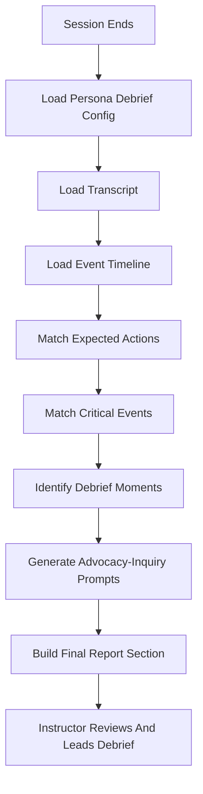

# Debriefing With Good Judgment Plan

## Purpose

This document plans how the AI Patient Voice system can use the Debriefing with
Good Judgment approach across all patient personas after a simulation session
ends.

The goal is to support faculty-led debriefing. The AI should organize session
evidence and suggest reflective prompts, but it should not replace instructor
judgment or directly grade students.

## Product Principle

The debriefing feature should follow this rule:

```text
Persona defines what matters clinically.
Session recording captures what happened.
Debrief engine maps session evidence to reflection prompts.
Instructor leads the final debrief.
```

## Good Judgment Pattern

Each debrief moment should use an advocacy-inquiry structure:

```text
Observed Moment
What happened in the transcript or event timeline.

Why It Matters
Clinical or communication relevance.

Advocacy Statement
The instructor names an observation or concern clearly.

Inquiry Question
The instructor asks learners what they were thinking.

Learning Focus
The clinical or teamwork concept connected to the moment.
```

The system should avoid judgmental or grading language.

Avoid:

```text
The student failed to recognize deterioration.
The learner made a mistake.
The student should have applied oxygen sooner.
```

Prefer:

```text
The record shows a deterioration cue occurred before an oxygen intervention.
This may be useful for exploring learner prioritization.
```

## Page And Workflow Placement

### Persona Page

The persona page should show a short preview of debrief focus areas:

```text
Learning objectives
Expected assessment areas
Critical events likely to be discussed
```

This helps instructors understand what the scenario is designed to teach before
starting the voice room.

### Voice Room

The voice room should continue recording:

```text
Student questions
AI patient responses
Instructor cues
Patient state changes
Pause/resume/takeover events
Voice connection events
Session start/end
```

The voice room should not run the debrief during the live simulation. It should
only collect evidence.

### Final Report

After the session ends, the final report should include:

```text
Debriefing With Good Judgment Guide
```

This section should be written for the instructor.

## Reusable Persona Configuration

Each persona should include a reusable `debrief_config` section.

Example structure:

```json
{
  "debrief_config": {
    "framework": "debriefing_with_good_judgment",
    "opening_prompt": "What are your initial reactions to this patient encounter?",
    "learning_objectives": [
      "Perform a focused assessment",
      "Recognize clinical deterioration",
      "Reassess after intervention"
    ],
    "expected_actions": [
      {
        "action_id": "ask_symptom_onset",
        "label": "Asked about symptom onset",
        "evidence_keywords": ["started", "when", "how long", "onset"],
        "learning_focus": "Focused assessment"
      }
    ],
    "critical_events": [
      {
        "event_type": "instructor_cue",
        "cue_id": "condition_worsened",
        "debrief_focus": "Recognition of deterioration",
        "advocacy_template": "I noticed the patient's condition changed and the patient appeared more uncomfortable.",
        "inquiry_template": "What were you thinking about the patient's condition at that moment?"
      }
    ],
    "closing_prompt": "What is one thing you would carry forward into the next patient encounter?"
  }
}
```

## COPD/SOB Example

For the current COPD/SOB persona, useful debrief topics include:

```text
Focused respiratory assessment
Recognition of worsening shortness of breath
Response to SpO2 drop
Therapeutic communication with an anxious patient
Reassessment after oxygen or bronchodilator intervention
Escalation or provider notification
```

Example generated debrief moment:

```text
Debrief Moment: Recognition of Respiratory Deterioration

Evidence:
Instructor cue: SpO2 dropped.
Patient response: "I feel like I am getting less air. It is harder to breathe."

Why It Matters:
The patient showed worsening respiratory distress.

Advocacy:
"I noticed the patient's oxygen level dropped and the patient became more breathless."

Inquiry:
"What were you thinking about the patient's respiratory status at that moment?"

Learning Focus:
Prioritizing respiratory assessment, intervention, and reassessment.
```

## Debrief Engine Control Flow



## Debrief Moment Data Shape

The report generator should create structured debrief moments before rendering
them in the frontend.

```json
{
  "moment_id": "recognition_of_deterioration",
  "title": "Recognition of Respiratory Deterioration",
  "evidence": [
    "SpO2 dropped to 88%.",
    "Patient reported increased difficulty breathing."
  ],
  "why_it_matters": "The patient showed worsening respiratory distress.",
  "advocacy_statement": "I noticed the patient's oxygen level dropped and the patient became more breathless.",
  "inquiry_question": "What were you thinking about the patient's respiratory status at that moment?",
  "learning_focus": "Respiratory assessment and prioritization."
}
```

## Backend Implementation Plan

### Step 1: Add Debrief Config To Scenario JSON

Add `debrief_config` to `copd_sob.json`.

Why:

```text
The debrief logic should be driven by the persona, not hard-coded in the report service.
```

### Step 2: Create Debrief Schemas

Add schemas for:

```text
DebriefConfig
ExpectedAction
CriticalEventDebriefRule
DebriefMoment
GoodJudgmentDebriefGuide
```

Why:

```text
The report output should stay predictable as more personas are added.
```

### Step 3: Create Debrief Service

Create a backend service responsible for:

```text
Loading debrief_config
Checking transcript evidence
Checking timeline events
Building debrief moments
Returning a structured debrief guide
```

Why:

```text
The final report service should call debrief logic, not contain all of it directly.
```

### Step 4: Update Report Service

Add the Good Judgment guide to the final report response.

Why:

```text
The final report is the correct place for post-session faculty support.
```

### Step 5: Update Frontend Report View

Show the debrief guide as a clear report section.

Suggested display:

```text
Debriefing With Good Judgment Guide

Opening Prompt
Debrief Moments
Closing Prompt
Faculty Reminder
```

Why:

```text
The instructor should be able to use the report directly during debriefing.
```

## Frontend Display Plan

The report should show each debrief moment in a compact card:

```text
Title
Evidence from session
Advocacy
Inquiry
Learning focus
```

The section should include a reminder:

```text
This guide supports faculty-led reflection and does not replace instructor judgment.
```

## Safety And Privacy Rules

The debrief guide must:

```text
Use session evidence only
Avoid grading language
Avoid diagnosing learner intent
Avoid making claims not supported by transcript or events
Keep faculty in control of debriefing
Use de-identified or fictional patient information only
```

## Success Criteria

The feature is successful when:

```text
Every persona can define its own debrief_config.
The final report includes Good Judgment debrief prompts.
Prompts are based on transcript and timeline evidence.
The system supports instructor reflection without replacing faculty judgment.
The same engine works for COPD/SOB and future personas.
```

## Future Production Enhancements

For a production version:

```text
Store debrief_config in the database.
Allow admins to edit debrief rules in the scenario editor.
Let faculty mark debrief moments as useful or not useful.
Support institution-specific debrief templates.
Add export to PDF or DOCX.
Track which prompts were used during debriefing.
```

## Implementation Tracking

### 2026-07-29 - Step 1: Add Debrief Config To COPD/SOB Scenario

What changed:

```text
Added a reusable debrief_config section to the COPD/SOB scenario JSON.
```

Why:

```text
The debriefing engine should be driven by persona-specific teaching rules instead
of hard-coded only for one scenario.
```

How:

```text
The COPD/SOB scenario now defines:
- Debriefing framework name
- Faculty reminder
- Opening prompt
- Expected learner actions
- Evidence keywords for matching transcript content
- Critical instructor-cued events
- Advocacy templates
- Inquiry templates
- Learning focus areas
- Closing prompt
```

Where:

```text
codes/backend/app/scenarios/copd_sob.json
```

Current behavior:

```text
This is a data-only change. The app does not display the Good Judgment guide yet.
The next implementation step is to create backend schemas for this debrief_config.
```

### 2026-07-29 - Step 2: Create Debrief Schemas

What changed:

```text
Added backend Pydantic schemas for Good Judgment debrief configuration and
generated debrief guide output.
```

Why:

```text
The debrief engine needs predictable typed structures before it can safely read
persona debrief rules and produce final report sections.
```

How:

```text
Created schemas for:
- DebriefFramework
- ExpectedAction
- CriticalEventDebriefRule
- DebriefConfig
- ExpectedActionFinding
- DebriefMoment
- GoodJudgmentDebriefGuide
```

Where:

```text
codes/backend/app/schemas/debrief.py
```

Current behavior:

```text
This step adds schema definitions only. The final report still does not generate
or display the Good Judgment guide. The next implementation step is to create the
debrief service that reads transcript/timeline evidence and builds these schema
objects.
```
