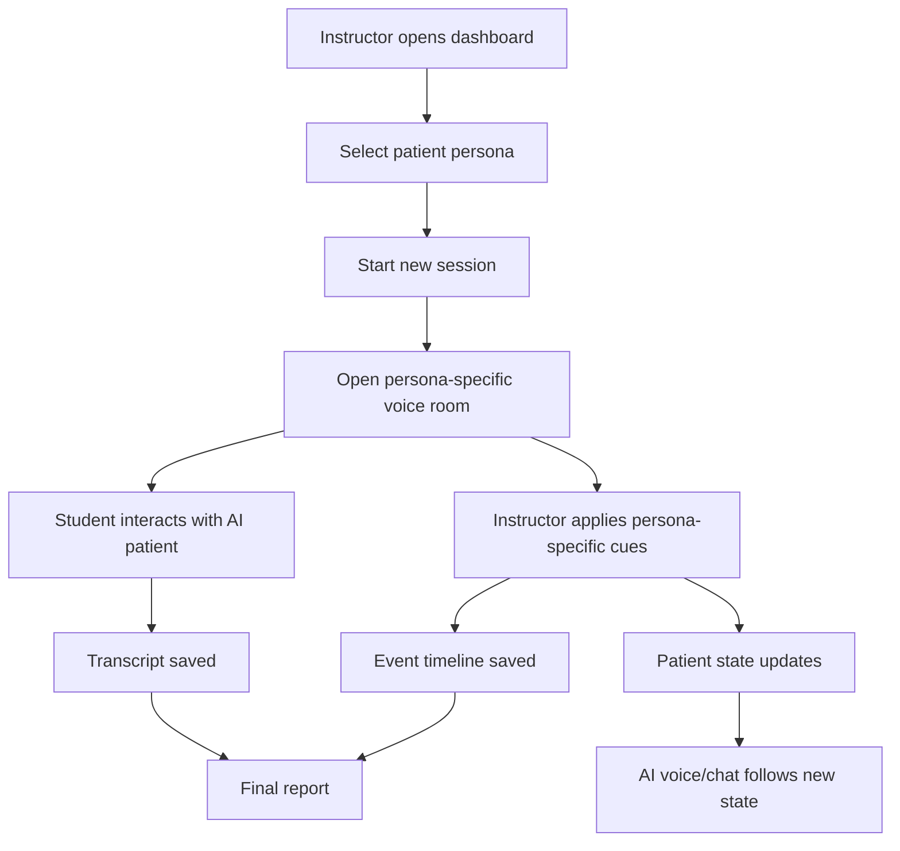

# Step 10: Multiple Patient Personas and Scenario-Specific Windows

Date: July 15, 2026

## Implementation Tracking

### 2026-07-29 - Persona Page Navigation Button Style Alignment

What changed:

```text
Updated the persona page navigation buttons to match the compact navigation
button style used on the voice room page.
```

Why:

```text
The persona page and voice room are part of the same multi-persona workflow.
Using the same navigation button style makes the transition between pages feel
consistent and product-like.
```

How:

```text
Changed the "Start Voice Room" link to use the shared header-link navigation
class.
Added persona-topbar-specific header-link styling that mirrors the voice room
navigation button dimensions, font weight, padding, and hover behavior.
Removed the older large persona-start-button styling from the active persona
page navigation flow.
```

Where:

```text
codes/frontend/src/pages/PersonaPage.tsx
codes/frontend/src/styles.css
```

### 2026-07-29 - MP-1: Scenario Registry And Generic Loader

What changed:

```text
Created a backend scenario registry and generic scenario loader.
```

Why:

```text
The backend should not depend only on load_copd_sob_scenario().
Future personas such as Chest Pain should be loaded by scenario_id using the same
code path.
```

How:

```text
Added:
- SCENARIO_REGISTRY
- load_scenario(scenario_id)
- list_scenarios()
- ScenarioNotFoundError
- scenario_id validation between the registry and JSON file
```

Where:

```text
codes/backend/app/services/scenario_loader.py
```

Compatibility:

```text
load_copd_sob_scenario() still exists and now calls load_scenario("copd-sob").
This keeps existing COPD/SOB state, chat, voice, and report code working while
we refactor toward multi-persona support.
```

Current behavior:

```text
Only copd-sob is registered today. Chest Pain will become a new registry entry
after its scenario JSON exists.
```

Next step:

```text
MP-2: Add generic scenario API endpoints:
- GET /scenarios
- GET /scenarios/{scenario_id}
```

### 2026-07-29 - MP-2: Generic Scenario API Endpoints

What changed:

```text
Added generic backend scenario API endpoints.
```

Why:

```text
The frontend should eventually load persona cards and persona pages from scenario
data instead of hard-coded COPD/SOB values.
```

How:

```text
Added:
- GET /scenarios
- GET /scenarios/{scenario_id}
- ScenarioSummary response model
- ScenarioListResponse response model
- 404 handling for unknown scenario_id values
- card_summary metadata in the COPD/SOB scenario JSON
```

Where:

```text
codes/backend/app/api/scenarios.py
codes/backend/app/scenarios/copd_sob.json
```

Compatibility:

```text
The existing COPD/SOB persona settings endpoints still work:
- GET /scenarios/copd-sob/persona-settings
- PATCH /scenarios/copd-sob/persona-settings
```

Current behavior:

```text
Only copd-sob is listed because it is the only registered scenario today.
The API shape is now ready for Chest Pain once chest_pain.json is added to the
scenario registry.
```

Next step:

```text
MP-3: Convert the frontend dashboard to load persona cards from GET /scenarios.
```

### 2026-07-29 - MP-3: Dashboard Loads Personas From Scenario API

What changed:

```text
Converted the frontend dashboard from a hard-coded persona list to a backend-driven
scenario list.
```

Why:

```text
The dashboard should automatically show registered personas from the backend
scenario registry. Adding a future persona should not require editing the
dashboard card array by hand.
```

How:

```text
Added frontend scenario API types and getScenarios().
Dashboard now:
- calls GET /scenarios
- stores returned ScenarioSummary objects
- renders persona cards from backend data
- shows loading state while scenarios load
- shows an empty state if no scenarios are registered
- shows an error if the backend scenario list fails
- links available personas to /personas/{scenario_id}
```

Where:

```text
codes/frontend/src/api/scenarios.ts
codes/frontend/src/pages/Dashboard.tsx
```

Compatibility:

```text
The backend currently returns only copd-sob because it is the only registered
scenario. The dashboard will automatically show Chest Pain after chest-pain is
registered in the backend scenario registry.
```

Current behavior:

```text
The dashboard is now scenario-registry driven. The next step is to make the
persona page route dynamic so /personas/{scenario_id} can render any selected
scenario instead of only COPD/SOB.
```

### 2026-07-29 - MP-7: Voice Room Uses Active Scenario Cues

What changed:

```text
Updated the Voice Room so instructor cue buttons are loaded from the active
scenario instead of a hard-coded COPD/SOB frontend array.
```

Why:

```text
Each persona needs its own instructor controls. The Voice Room should render
whatever instructor_cues are defined by the active scenario JSON so future
personas such as Chest Pain do not require custom Voice Room code.
```

How:

```text
Voice Room now:
- reads the active scenario_id from patient state
- loads scenario details with getScenario(scenario_id)
- renders currentScenario.instructor_cues
- uses each cue's state_updates for optimistic UI state changes
- keeps the existing backend cue endpoint and state-manager behavior
- derives a visual control icon from cue_id/label
- displays the active scenario name in the Voice Room title
- links back to /personas/{scenario_id}
```

Where:

```text
codes/frontend/src/pages/VoiceRoom.tsx
```

Compatibility:

```text
COPD/SOB still works because its cues are already in copd_sob.json.
Chest Pain cues will appear automatically after the Chest Pain scenario is
registered and selected as the active state scenario.
```

Current behavior:

```text
The Voice Room is now scenario-cue driven. It still expects the backend active
state to identify the active scenario.
```

Next step:

```text
MP-8: Make the report service load the scenario from session.scenario_id instead
of always using COPD/SOB.
```

### 2026-07-29 - MP-8: Scenario-Aware Final Report Service

What changed:

```text
Updated the final report service so reports are built from the scenario_id stored
on the session record.
```

Why:

```text
Final reports must match the persona that was actually used in the session.
Chest Pain reports should not use COPD/SOB titles, prompts, checklist items, or
debrief configuration.
```

How:

```text
Backend:
- Replaced load_copd_sob_scenario() with load_scenario(session.scenario_id)
- Generates report_title from scenario_name
- Builds suggested debrief prompts from scenario learning_objectives and
  debrief_config critical events
- Keeps assessment checklist and Good Judgment guide scenario-driven
- Makes communication observations generic enough for multiple personas
- Returns a clear 404 if a session references an unknown scenario
```

Where:

```text
codes/backend/app/services/report_service.py
codes/backend/app/api/sessions.py
```

Compatibility:

```text
COPD/SOB reports still work because COPD/SOB remains registered as copd-sob.
Existing session records with scenario_id="copd-sob" continue to load the same
scenario JSON and Good Judgment debrief_config.
```

Current behavior:

```text
The report layer is now ready for Chest Pain once chest-pain is registered and
sessions are started with scenario_id="chest-pain".
```

Next step:

```text
MP-9: Add Chest Pain scenario JSON and register it.
```

### 2026-07-29 - MP-9: Add Chest Pain Scenario JSON And Register It

What changed:

```text
Added Chest Pain / Suspected Cardiac Event as the second registered persona.
```

Why:

```text
The system needs a second persona to prove that the scenario registry, dashboard,
voice room cues, reports, and Good Judgment debriefing can work beyond COPD/SOB.
```

How:

```text
Added a new chest_pain.json scenario with:
- scenario metadata and dashboard card_summary
- patient profile
- chief complaint
- cardiac-focused learning objectives
- initial state that fits the current PatientState schema
- allowed patient disclosures
- hidden information rules
- instructor cues
- scenario-specific auto patient reactions
- safety rules
- assessment checklist
- Debriefing with Good Judgment debrief_config

Registered chest-pain in SCENARIO_REGISTRY.
Updated auto patient reactions so scenarios can define cue-specific immediate
patient responses through auto_patient_reactions.
```

Where:

```text
codes/backend/app/scenarios/chest_pain.json
codes/backend/app/services/scenario_loader.py
codes/backend/app/services/auto_patient_message.py
```

Compatibility:

```text
COPD/SOB still works. The auto reaction service still uses its existing fallback
messages when a scenario does not define auto_patient_reactions.
```

Current behavior:

```text
GET /scenarios should now return copd-sob and chest-pain.
Chest Pain is registered and available for dashboard rendering.
Some deeper state fields are still limited by the current shared PatientState
schema, so richer cardiac-specific fields can be added in a later state-schema
refactor.
```

### 2026-07-29 - MP-10: Enable Chest Pain Dashboard Card With Icon

What changed:

```text
Enabled Chest Pain to appear on the dashboard through the scenario API and added
scenario-driven dashboard icons.
```

Why:

```text
The dashboard should show available personas from backend scenario metadata.
Icons should also come from scenario metadata so future personas can choose their
own icon without changing dashboard logic.
```

How:

```text
Added card_summary.icon to scenario JSON files:
- copd-sob uses lungs
- chest-pain uses heart-ecg

Added icon to ScenarioSummary.
Updated the dashboard to render icons from scenario.icon.
Added a lungs icon and reused the heart ECG icon for the cardiac persona.
```

Where:

```text
codes/backend/app/scenarios/copd_sob.json
codes/backend/app/scenarios/chest_pain.json
codes/backend/app/api/scenarios.py
codes/frontend/src/api/scenarios.ts
codes/frontend/src/pages/Dashboard.tsx
codes/frontend/src/styles.css
```

Current behavior:

```text
GET /scenarios returns both registered personas with icon metadata.
Dashboard renders COPD/SOB with a lungs icon and Chest Pain with a heart ECG icon.
Both cards use backend availability metadata.
```

### 2026-07-29 - Persona Page Navigation: Move Voice Room Action To Topbar

What changed:

```text
Moved the Start Voice Room action from the Baseline State card into the persona
page navigation bar.
```

Why:

```text
The Voice Room is the main transition from a persona page into a live session.
Putting it in the top navigation makes it visible and consistent for both COPD/SOB
and Chest Pain without crowding the baseline-state clinical information.
```

How:

```text
The shared PersonaPage component now renders Start Voice Room in
persona-topbar-actions using the active scenario_id. The duplicate content-card
button was removed from the Baseline State section.
```

Where:

```text
codes/frontend/src/pages/PersonaPage.tsx
codes/frontend/src/styles.css
```

Current behavior:

```text
Both persona pages show Dashboard, Start Voice Room, and backend connection status
in the navigation bar. The Start Voice Room link still opens
/voice?scenario_id={scenario_id}.
```

### 2026-07-29 - MP-6: Scenario-Aware Patient State Manager

What changed:

```text
Generalized patient state initialization and cue handling so state is based on
the active scenario_id instead of always loading COPD/SOB.
```

Why:

```text
Future personas need their own initial state, instructor cues, session records,
chat context, and voice instructions. If state remains hard-wired to COPD/SOB,
Chest Pain would still behave like the COPD patient.
```

How:

```text
Backend:
- get_current_state() can accept an optional scenario_id
- reset_state() can accept an optional scenario_id
- reset_state() without a scenario_id resets the current scenario, not always COPD
- apply_instructor_cue() loads cues from the current state's scenario_id
- /state accepts optional scenario_id for state load/reset
- chat responses load scenario context from current patient state
- Realtime voice instructions load scenario context from current patient state
- voice transcript/timeline events use the current state's scenario_id

Frontend:
- resetPatientState() and getPatientState() can pass scenario_id
- Persona page Start Voice Room link includes /voice?scenario_id={scenario_id}
- Voice room initializes state from the requested scenario_id when present
```

Where:

```text
codes/backend/app/services/state_manager.py
codes/backend/app/api/state.py
codes/backend/app/api/chat.py
codes/backend/app/api/voice.py
codes/backend/app/services/realtime_voice_service.py
codes/frontend/src/api/state.ts
codes/frontend/src/pages/PersonaPage.tsx
codes/frontend/src/pages/VoiceRoom.tsx
```

Compatibility:

```text
Existing /state and /voice calls still work without scenario_id and default to
the current scenario. If no state exists, the default scenario remains copd-sob.
```

Current behavior:

```text
Only copd-sob is registered today, so visible behavior remains the same. The
state layer is now ready for Chest Pain once chest-pain is registered.
```

Next step:

```text
MP-7: Make VoiceRoom render scenario-specific cue buttons from the active
scenario instead of a frontend hard-coded COPD cue array.
```

### 2026-07-29 - MP-5: Generic Persona Settings By Scenario ID

What changed:

```text
Converted persona settings from COPD-specific globals and API calls to a generic
settings store keyed by scenario_id.
```

Why:

```text
Future personas such as Chest Pain need the same editable settings controls
without adding a new set of get_chest_pain_* functions or hard-coded frontend API
calls.
```

How:

```text
Backend:
- Added a generic in-memory settings dictionary keyed by scenario_id
- Added get_persona_settings(scenario_id, scenario)
- Added update_persona_settings(scenario_id, scenario, ...)
- Added apply_persona_settings(scenario)
- Changed the scenario registry to use the generic settings applier
- Replaced COPD-only settings endpoints with:
  - GET /scenarios/{scenario_id}/persona-settings
  - PATCH /scenarios/{scenario_id}/persona-settings

Frontend:
- Added generic getPersonaSettings(scenarioId)
- Added generic updatePersonaSettings(scenarioId, settings)
- Updated PersonaPage to load and save settings for the selected scenarioId
- Removed the COPD-only editable-settings gate from PersonaPage
```

Where:

```text
codes/backend/app/services/persona_settings.py
codes/backend/app/services/scenario_loader.py
codes/backend/app/api/scenarios.py
codes/frontend/src/api/scenarios.ts
codes/frontend/src/pages/PersonaPage.tsx
```

Compatibility:

```text
The existing COPD/SOB URL still works because /scenarios/copd-sob/persona-settings
now matches the generic scenario_id endpoint.

Small compatibility wrappers remain for current Realtime voice service code until
MP-6/MP-7 make state and voice session handling active-scenario aware.
```

Current behavior:

```text
Any registered scenario can now expose editable age, gender, voice, and voice
affect through the same API and PersonaPage UI.
```

Next step:

```text
MP-6: Generalize state manager to active scenario_id so the voice room can run
the selected persona instead of always initializing COPD/SOB state.
```

### 2026-07-29 - MP-4: Dynamic Persona Page Route

What changed:

```text
Converted the persona page from a COPD-only route/page into a dynamic scenario
briefing page.
```

Why:

```text
The product needs one reusable persona page that can render COPD/SOB, Chest Pain,
and future scenarios from backend scenario JSON instead of duplicating one page
per persona.
```

How:

```text
Added frontend getScenario(scenario_id).
Updated routing so /personas/{scenario_id} renders PersonaPage with that ID.
PersonaPage now:
- loads /scenarios/{scenario_id}
- renders scenario_name in the page title
- renders patient name, age, gender, chief complaint, and scenario type from JSON
- renders baseline state metrics from initial_state
- renders instructor cue chips from instructor_cues
- renders learning goals from learning_objectives
- preserves existing COPD/SOB editable settings only when scenario_id is copd-sob
```

Where:

```text
codes/frontend/src/App.tsx
codes/frontend/src/api/scenarios.ts
codes/frontend/src/pages/PersonaPage.tsx
```

Compatibility:

```text
The COPD/SOB persona page still supports editable age, gender, voice, and voice
affect through the existing COPD-specific settings API.
```

Current limitation:

```text
Editable persona settings are still COPD-specific. MP-5 should generalize persona
settings by scenario_id.

The Start Voice Room button still opens /voice, and the voice/state system is
still tied to the current COPD/SOB state flow. Later steps should make the active
scenario flow into state, cues, voice instructions, and reports.
```

Next step:

```text
MP-5: Generalize persona settings by scenario_id.
```

## Why This Document Was Added

The current product has one working persona:

```text
Adult COPD Exacerbation / Shortness of Breath
```

That was the correct first persona because it helped prove the main workflow:

```text
instructor controls patient state
student speaks or chats with the AI patient
patient responds according to the latest state
transcript, events, and report are saved
```

To make the product useful beyond one demo, the system now needs multiple personas. Each persona must have its own scenario, patient profile, clinical state fields, instructor controls, voice behavior, transcript context, and report focus.

## Step 10 Goal

Add support for at least five additional patient personas while keeping the existing COPD/SOB persona safe.

The product should support:

- a persona selection screen
- separate voice-room windows for each selected persona
- scenario-specific instructor controls
- scenario-specific patient state display
- scenario-specific AI voice and chat behavior
- scenario-specific transcript and final report context
- independent sessions so two personas do not share state by mistake

## Product Direction

This should not be built as six separate hard-coded apps.

The scalable design should be:

```text
one product shell
multiple scenario/persona definitions
dynamic UI generated from each persona definition
separate session state per selected persona
```

This matters because a future sellable product may need many scenarios, such as respiratory, cardiac, neurological, maternal health, pediatric, mental health, emergency care, and medication safety.

## Existing Persona

### 1. COPD / Shortness of Breath

Purpose:

```text
Respiratory assessment, therapeutic communication, oxygen/inhaler history, response to worsening dyspnea.
```

Current major features:

- COPD patient profile
- shortness of breath chief complaint
- respiratory vitals
- oxygen and bronchodilator interventions
- anxiety and breathing effort state
- respiratory-focused instructor cues
- respiratory-focused final report

## Five Additional Personas

### 2. Chest Pain / Suspected Cardiac Event

Clinical area:

```text
cardiac / emergency nursing
```

Patient example:

```text
Middle-aged adult with chest pressure, diaphoresis, anxiety, and shortness of breath.
```

Unique patient state fields:

- chest pain severity
- pain location
- pain radiation
- nausea
- diaphoresis
- anxiety
- heart rate
- blood pressure
- SpO2
- aspirin given
- nitroglycerin given
- provider notified

Instructor cues:

- chest pain worsened
- pain radiating to left arm
- blood pressure dropped
- nitroglycerin given
- aspirin given
- patient improving
- patient becoming more anxious

Voice behavior:

```text
Patient speaks with fear, discomfort, and short sentences when pain increases.
```

Report focus:

- asked pain assessment questions
- assessed cardiac symptoms
- asked medication/allergy history
- communicated therapeutically
- reassessed after intervention
- recognized deterioration

### 3. Stroke / Neurological Change

Clinical area:

```text
neurology / emergency nursing
```

Patient example:

```text
Older adult with facial droop, slurred speech, confusion, and one-sided weakness.
```

Unique patient state fields:

- speech clarity
- orientation
- facial droop
- arm weakness
- headache
- dizziness
- blood pressure
- heart rate
- time last known well
- glucose checked
- stroke team notified

Instructor cues:

- speech worsened
- weakness worsened
- confusion increased
- severe headache reported
- glucose checked
- stroke team notified
- patient stabilized

Voice behavior:

```text
Patient may speak slowly, slur words, show confusion, or have trouble answering clearly.
```

Report focus:

- assessed orientation
- recognized stroke symptoms
- asked last known well
- checked glucose
- escalated appropriately
- communicated clearly with confused patient

### 4. Sepsis / Infection Deterioration

Clinical area:

```text
medical-surgical / emergency nursing
```

Patient example:

```text
Adult patient with fever, weakness, suspected infection, tachycardia, and worsening mental status.
```

Unique patient state fields:

- temperature
- heart rate
- respiratory rate
- blood pressure
- SpO2
- pain
- chills
- fatigue
- mental status
- fluids started
- antibiotics ordered/given
- provider notified

Instructor cues:

- fever increased
- blood pressure dropped
- mental status worsened
- chills worsened
- fluids started
- antibiotics given
- patient improving

Voice behavior:

```text
Patient sounds weak, tired, sometimes confused, and may answer slowly during deterioration.
```

Report focus:

- recognized infection concerns
- monitored vital signs
- assessed mental status
- escalated hypotension
- reassessed after fluids/antibiotics
- used calm communication

### 5. Hypoglycemia / Diabetic Emergency

Clinical area:

```text
endocrine / emergency nursing
```

Patient example:

```text
Adult patient with diabetes who is shaky, sweaty, confused, hungry, and weak.
```

Unique patient state fields:

- blood glucose
- orientation
- tremor
- diaphoresis
- hunger
- weakness
- irritability
- oral glucose given
- IV dextrose given
- meal provided

Instructor cues:

- glucose dropped
- confusion worsened
- patient became irritable
- oral glucose given
- IV dextrose given
- glucose improved
- patient fully oriented

Voice behavior:

```text
Patient may sound shaky, confused, frustrated, or relieved after glucose improves.
```

Report focus:

- recognized hypoglycemia symptoms
- checked blood glucose
- assessed safety and orientation
- provided or requested appropriate intervention
- reassessed after glucose correction

### 6. Postpartum Hemorrhage / Maternal Emergency

Clinical area:

```text
maternal health / obstetric nursing
```

Patient example:

```text
Postpartum patient with dizziness, weakness, anxiety, increased bleeding, and signs of shock.
```

Unique patient state fields:

- bleeding amount
- fundal tone
- dizziness
- pain/cramping
- anxiety
- heart rate
- blood pressure
- skin condition
- fundal massage performed
- IV fluids started
- provider notified
- medication given

Instructor cues:

- bleeding increased
- dizziness worsened
- blood pressure dropped
- fundus boggy
- fundal massage performed
- fluids started
- medication given
- patient improving

Voice behavior:

```text
Patient sounds frightened, weak, and dizzy during worsening bleeding.
```

Report focus:

- recognized postpartum hemorrhage signs
- assessed bleeding and fundus
- escalated quickly
- reassured patient
- reassessed after interventions

## Why Separate Windows Are Needed

Each persona has different clinical logic.

For example:

```text
COPD needs breathing effort, SpO2, oxygen, bronchodilator.
Stroke needs speech clarity, weakness, orientation, last known well.
Postpartum hemorrhage needs bleeding amount, fundal tone, dizziness, blood pressure.
```

If all personas used the same fixed window, the UI would become confusing and clinically weak. A respiratory patient should not show stroke controls, and a stroke patient should not show bronchodilator controls.

The better design is:

```text
Persona selection screen
  -> opens selected persona voice room
  -> voice room renders only that persona's state fields and instructor controls
  -> session stores selected scenario_id
  -> transcript/report use selected persona context
```

## Recommended User Flow



## Window Design

### Persona Selection Window

Purpose:

```text
Choose which patient persona/scenario to run.
```

Should show:

- persona name
- clinical area
- chief complaint
- difficulty level
- estimated simulation time
- learning objectives
- Start Session button
- Open Voice Room button after session starts

### Persona-Specific Voice Room

Purpose:

```text
Run the live simulation for one selected persona.
```

Should show:

- top patient state summary
- left side: instructor controls for the selected persona
- right side: voice controls and patient conversation
- scenario-specific patient state fields
- transcript and events linked to the selected session

Recommended route:

```text
/voice/:scenarioId
```

Example:

```text
/voice/copd-sob
/voice/chest-pain
/voice/stroke-neuro
/voice/sepsis
/voice/hypoglycemia
/voice/postpartum-hemorrhage
```

### Report Window

Purpose:

```text
Review the completed session using that persona's objectives and checklist.
```

Should show:

- session summary
- transcript
- event timeline
- scenario-specific learning objective coverage
- scenario-specific assessment checklist
- AI-generated debrief notes
- faculty reminder that the report supports but does not replace instructor judgment

## Architecture Decision

Use scenario definitions as the source of truth.

Each persona should be defined by structured scenario data:

```text
scenario_id
scenario_name
clinical_area
patient_profile
chief_complaint
initial_state
state_display_config
instructor_cues
voice_behavior_rules
allowed_disclosures
hidden_information
safety_rules
assessment_checklist
report_focus
```

The frontend should not need custom code for every persona. It should read the scenario definition and render:

- state cards
- cue buttons
- chat/voice instructions
- report sections

## Proposed Scenario File Structure

```text
codes/backend/app/scenarios/
  copd_sob.json
  chest_pain.json
  stroke_neuro.json
  sepsis.json
  hypoglycemia.json
  postpartum_hemorrhage.json
```

Each file should follow the same general contract but allow persona-specific fields.

## Proposed Frontend Screen Structure

```text
codes/frontend/src/pages/
  Dashboard.tsx              persona selection and session launch
  VoiceRoom.tsx              dynamic voice room for selected persona
  Chat.tsx                   reusable patient conversation

codes/frontend/src/components/
  PersonaCard.tsx            reusable persona selection card
  PatientStatePanel.tsx      dynamic state display
  InstructorCuePanel.tsx     dynamic cue buttons
  VoiceControls.tsx          reusable voice controls
  SessionReportPanel.tsx     report display
```

This is a future structure recommendation. It should be introduced carefully so current working code is not broken.

## Backend Changes Needed Later

No code is being changed in this document, but future implementation should add:

- API to list all available personas
- API to load one persona by `scenario_id`
- session creation with selected `scenario_id`
- dynamic initial state loading from selected scenario
- cue application using selected scenario's cue list
- voice instruction builder using selected scenario
- report generator using selected scenario's checklist and learning objectives

Recommended API shape:

```text
GET  /scenarios
GET  /scenarios/{scenario_id}
POST /sessions
GET  /sessions/{session_id}
POST /sessions/{session_id}/state/cues/{cue_id}
GET  /sessions/{session_id}/transcript
GET  /sessions/{session_id}/events
GET  /sessions/{session_id}/report
```

## Important Product Rule

Every live interaction must be tied to a session.

This avoids dangerous confusion such as:

```text
instructor changes COPD state
but stroke voice room receives the change
```

Each session should store:

- session_id
- scenario_id
- current patient state
- transcript entries
- timeline events
- report output

## Data Isolation Rule

Each persona window must load and update only its own active session.

Recommended frontend state:

```text
selectedScenarioId
activeSessionId
currentPatientState
transcriptForActiveSession
timelineForActiveSession
voiceConnectionForActiveSession
```

## Voice Behavior Rule

The Realtime voice instructions must be rebuilt from:

```text
selected scenario
current patient state
latest instructor cue
safety rules
allowed disclosures
hidden information
```

This means a stroke patient can speak with confusion/slurring rules, while a COPD patient can speak with breathless short-phrase rules.

## Report Rule

Reports must be scenario-specific.

The report for COPD should not evaluate stroke criteria, and the stroke report should not evaluate oxygen/inhaler history unless that scenario explicitly includes it.

## Recommended Implementation Substeps

### 10.1 Create Multi-Persona Design Document

Status:

```text
done
```

Purpose:

```text
Plan how multiple personas will work before coding.
```

### 10.2 Define Shared Scenario Schema

Create a clear JSON contract that every persona must follow.

Why:

```text
This keeps personas consistent while allowing each clinical scenario to have different fields.
```

### 10.3 Add Five New Scenario JSON Files

Create draft scenario definitions for:

- chest pain
- stroke/neuro change
- sepsis
- hypoglycemia
- postpartum hemorrhage

Why:

```text
The product needs more than one scenario to feel useful and scalable.
```

### 10.4 Add Scenario List API

Backend should return all available scenarios.

Why:

```text
The dashboard needs to display persona options dynamically.
```

### 10.5 Add Scenario Detail API

Backend should return one scenario by `scenario_id`.

Why:

```text
The voice room needs the selected persona's profile, state fields, cues, and rules.
```

### 10.6 Add Session Creation by Scenario

Starting a session should require a selected `scenario_id`.

Why:

```text
This prevents transcript, state, and report data from mixing across personas.
```

### 10.7 Update Dashboard to Persona Selection

Dashboard should show persona cards and allow instructor to start/open a session.

Why:

```text
The instructor should choose the patient before entering the simulation room.
```

### 10.8 Update Voice Room to Load Scenario Dynamically

Voice room should load by scenario/session instead of assuming COPD.

Why:

```text
Each persona has different state fields and cue buttons.
```

### 10.9 Render Dynamic Patient State Fields

State panel should render from `state_display_config`.

Why:

```text
COPD, stroke, sepsis, hypoglycemia, and postpartum hemorrhage all need different visible state fields.
```

### 10.10 Render Dynamic Instructor Cue Buttons

Cue buttons should come from the selected scenario file.

Why:

```text
The instructor should only see clinically relevant controls for the selected persona.
```

### 10.11 Update Voice Instructions Per Persona

Realtime instructions should use selected scenario and selected patient state.

Why:

```text
Voice behavior must match the clinical condition, personality, and safety rules of that persona.
```

### 10.12 Update Report Generation Per Persona

Report generator should use the selected scenario's objectives and checklist.

Why:

```text
Debrief support must be clinically relevant to the chosen simulation.
```

### 10.13 Verify One Persona at a Time

Test each persona separately before running multiple windows.

Why:

```text
This reduces the chance of state leakage, wrong cue behavior, or wrong report criteria.
```

## Acceptance Criteria

Step 10 is successful when:

- at least six total personas exist including COPD
- instructor can select a persona from the dashboard
- selected persona opens in its own voice-room window
- each persona shows only its own patient state fields
- each persona shows only its own instructor cues
- patient voice/chat follows the selected persona
- transcript and event timeline are stored under the correct session
- final report uses the selected persona's objectives and checklist
- no API key or secret is exposed to the frontend
- existing COPD/SOB workflow still works

## Risks

### Risk: UI Becomes Too Generic

If the UI is too generic, it may feel clinically vague.

Mitigation:

```text
Use shared components, but allow persona-specific labels, state groups, cue groups, and report focus.
```

### Risk: State Leaks Between Personas

If the app uses one global patient state, changing one persona could affect another.

Mitigation:

```text
Tie every state update to session_id and scenario_id.
```

### Risk: Too Much Work Before Deadline

Creating five polished personas could become large.

Mitigation:

```text
Create clinically reasonable draft personas first.
Make COPD and one new persona demo-ready.
Keep the other four as selectable draft scenarios if time is short.
```

### Risk: Clinical Accuracy Needs Faculty Review

AI-generated or developer-written scenarios may miss clinical details.

Mitigation:

```text
Mark scenarios as draft until reviewed by a nursing simulation faculty member.
```

## Recommended July 25 Demo Strategy

For the deadline, prioritize:

```text
1. COPD/SOB fully working
2. Persona selection screen working
3. One additional persona fully working, preferably chest pain or hypoglycemia
4. Remaining personas visible as draft scenarios
5. Voice, transcript, event timeline, and report still working for the selected scenario
```

This shows the product is not just a one-scenario prototype while still protecting the demo from becoming too large to finish well.
