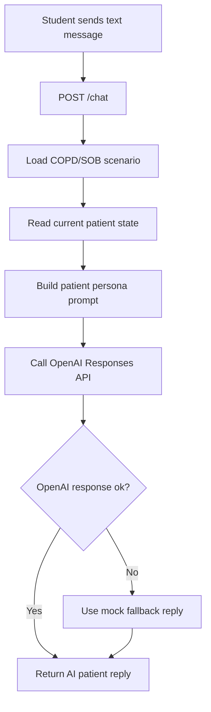

# Step 6: OpenAI Text Persona Using Current Patient State

Date: June 30, 2026

## Why This Document Was Added

This document was added because Step 6 is the next production-value step after the instructor dashboard and the isolated voice spike.

The voice spike proved that voice is feasible, but the main product should first make the text patient persona realistic, state-aware, and reliable. This gives the July 25 demo a stronger core workflow:

```text
student asks question
    |
    v
backend reads scenario + current instructor-cued patient state
    |
    v
OpenAI generates patient response
    |
    v
dashboard shows the response
```

The voice spike folder remains separate and is not part of this step.

## Step 6 Goal

Replace the current rule-based mock patient response with an OpenAI-powered text response while preserving the same `/chat` API and the same instructor-cued state workflow.

The AI must respond as the simulated COPD patient and follow the latest backend patient state.

## Product Value

Step 6 makes the project feel less like a scripted chatbot and more like a realistic simulated patient.

This is valuable for:

- nursing simulation realism
- faculty demo credibility
- future voice integration
- future transcript/report generation
- product scalability after the internship

## Scope

Step 6 will build:

- OpenAI text persona service
- persona prompt builder
- backend OpenAI configuration
- secure API key loading from backend `.env`
- mock fallback behavior
- state-aware OpenAI responses through the existing `/chat` route
- backend tests using baseline and changed patient states

Step 6 will not build:

- voice interaction in the main app
- database persistence
- final reports
- authentication
- multi-session production storage
- direct Laerdal/LLEAP/SimCapture integration

## Existing Starting Point

Current chat flow:

```text
POST /chat
    |
    v
load COPD/SOB scenario
    |
    v
get current patient state
    |
    v
build_mock_persona_response()
    |
    v
return patient reply
```

Current files involved:

```text
codes/backend/app/api/chat.py
codes/backend/app/services/mock_persona.py
codes/backend/app/services/scenario_loader.py
codes/backend/app/services/state_manager.py
codes/backend/app/schemas/chat.py
codes/backend/app/core/config.py
codes/backend/app/scenarios/copd_sob.json
```

## Target Flow



## Design Decision

Keep `mock_persona.py` as a fallback.

Reason:

- the demo should still work if the OpenAI API key is missing
- the demo should still work if network/API access fails
- the mock service is useful for tests
- the product can support demo/offline mode later

The OpenAI service should be added beside the mock service, not replace it completely.

## API Boundary

The frontend should not change for Step 6.

Existing API remains:

```text
POST /chat
```

Request:

```json
{
  "message": "How are you feeling?"
}
```

Response:

```json
{
  "reply": "I feel really short of breath, and I am scared.",
  "scenario_id": "copd-sob",
  "speaker": "patient"
}
```

Reason:

Keeping the same API prevents frontend churn and protects the dashboard work already completed.

## Backend Configuration

Add or confirm these values in backend configuration:

```text
OPENAI_API_KEY
OPENAI_TEXT_MODEL
USE_OPENAI_PERSONA
OPENAI_REQUEST_TIMEOUT_SECONDS
OPENAI_MAX_OUTPUT_TOKENS
OPENAI_REASONING_EFFORT
OPENAI_TEXT_VERBOSITY
```

Recommended local `.env` location:

```text
codes/backend/.env
```

Security rule:

```text
The OpenAI API key must only be stored in backend .env files.
It must never be placed in frontend code, Markdown files, screenshots, or GitHub.
```

## Proposed Files

New files:

```text
codes/backend/app/services/persona_prompt_builder.py
codes/backend/app/services/openai_persona.py
```

Modified files:

```text
codes/backend/app/core/config.py
codes/backend/app/api/chat.py
codes/backend/requirements.txt
codes/backend/.env.example
codes/docs/Step6_OpenAI_Text_Persona.md
Progress_Report.md
```

## File Responsibilities

### `persona_prompt_builder.py`

Purpose:

Build the instruction and context package sent to OpenAI.

It should include:

- patient identity
- scenario chief complaint
- allowed disclosures
- hidden information rules
- safety rules
- latest patient state
- current student message

Why:

Prompt construction should be isolated so it can be tested and improved without changing the API route.

### `openai_persona.py`

Purpose:

Call the OpenAI text model and return the patient reply.

It should:

- use backend config
- call OpenAI from the backend only
- enforce short patient-style responses
- handle errors cleanly
- return fallback response when needed

Why:

The API route should stay thin. OpenAI-specific logic belongs in a service.

### `chat.py`

Purpose:

Coordinate the chat request:

```text
request message
scenario
current state
OpenAI persona service
response
```

Why:

The route owns request/response behavior, but not prompt engineering or API details.

## Prompt Requirements

The prompt must tell the model:

- speak only as the patient
- use first person
- do not act as nurse, doctor, instructor, or evaluator
- do not give treatment orders
- do not grade student performance
- do not reveal the diagnosis unless allowed
- follow the latest instructor-cued state
- keep responses short when breathing effort is severe
- answer only using fictional scenario information

## State-Aware Behavior Examples

Baseline state:

```text
Student: How are you feeling?
Patient: I am short of breath and a little scared.
```

After `spo2_dropped`:

```text
Student: Are you feeling worse?
Patient: Yes. I cannot catch my breath, and I feel more scared.
```

After `hr_increased`:

```text
Student: What do you feel now?
Patient: My heart feels like it is racing.
```

After `oxygen_applied`:

```text
Student: Is the oxygen helping?
Patient: A little, but I still feel short of breath.
```

## Error and Fallback Behavior

If OpenAI cannot be called:

```text
Use build_mock_persona_response()
```

The backend should not expose raw OpenAI error details to the frontend.

Recommended frontend-safe message behavior:

```text
Return a patient reply from the mock fallback.
Log the technical error only on the backend.
```

Why:

The demo should not fail in front of faculty because of temporary network/API issues.

## Step 6 Substeps

### 6.1 Create Step 6 documentation

Status:

```text
Completed
```

Files:

```text
codes/docs/Step6_OpenAI_Text_Persona.md
codes/docs/Phase1_Build_Steps.md
Progress_Report.md
```

### 6.2 Add backend OpenAI configuration

Add OpenAI text settings to backend config and `.env.example`.

Do not call OpenAI yet.

Status:

```text
Completed
```

Files changed:

```text
codes/backend/app/core/config.py
codes/backend/.env.example
codes/docs/Step6_OpenAI_Text_Persona.md
Progress_Report.md
```

What was added:

```text
OPENAI_TEXT_MODEL=gpt-5.5
USE_OPENAI_PERSONA=false
OPENAI_REQUEST_TIMEOUT_SECONDS=20
OPENAI_MAX_OUTPUT_TOKENS=180
OPENAI_REASONING_EFFORT=low
OPENAI_TEXT_VERBOSITY=low
```

Why:

- `OPENAI_TEXT_MODEL` chooses the text model for the patient persona.
- `USE_OPENAI_PERSONA=false` prevents accidental OpenAI calls until the service is wired intentionally.
- `OPENAI_REQUEST_TIMEOUT_SECONDS` prevents slow API calls from hanging the demo.
- `OPENAI_MAX_OUTPUT_TOKENS` keeps patient replies short.
- `OPENAI_REASONING_EFFORT=low` favors lower latency for live simulation chat.
- `OPENAI_TEXT_VERBOSITY=low` supports concise patient-style responses.

### 6.3 Add OpenAI dependency

Add the official OpenAI Python package to backend requirements.

Verify dependency installation in the backend virtual environment.

Status:

```text
Completed
```

Files changed:

```text
codes/backend/requirements.txt
codes/docs/Step6_OpenAI_Text_Persona.md
Progress_Report.md
```

What was added:

```text
openai==2.44.0
```

Why:

- The backend needs the official OpenAI Python SDK before the OpenAI persona service can be built.
- Pinning the installed version makes the project easier to reproduce on another machine.
- Installing the dependency now verifies that the backend virtual environment can import the SDK before service code is added.

What was not changed:

```text
No OpenAI API call was added.
No chat route behavior was changed.
No frontend code was changed.
USE_OPENAI_PERSONA remains false.
```

### 6.4 Build persona prompt builder

Create prompt-building logic using scenario and patient state.

Test prompt output without calling OpenAI.

Status:

```text
Completed
```

Files changed:

```text
codes/backend/app/services/persona_prompt_builder.py
codes/docs/Step6_OpenAI_Text_Persona.md
Progress_Report.md
```

What was added:

```text
PersonaPrompt
build_persona_prompt()
```

Where it fits:

```text
scenario JSON + current PatientState + student message
    |
    v
build_persona_prompt()
    |
    v
instructions + input_text
    |
    v
future OpenAI persona service
```

Why:

- Prompt construction should be isolated from the `/chat` route.
- The OpenAI service should receive a clean prompt package instead of building scenario/state text itself.
- The prompt can now be tested without making any OpenAI API calls.
- The builder includes scenario rules, hidden information rules, allowed disclosures, current patient state, and the student message.

What was not changed:

```text
No OpenAI API call was added.
No chat route behavior was changed.
No frontend code was changed.
USE_OPENAI_PERSONA remains false.
```

Verification:

```text
Compiled persona_prompt_builder.py successfully.
Generated a baseline prompt from COPD/SOB scenario and current patient state.
Confirmed the generated prompt includes patient role rules, current state, and the student message.
```

### 6.5 Build OpenAI persona service

Create the backend service that calls OpenAI text generation.

Keep this isolated from `chat.py`.

Status:

```text
Completed
```

Files changed:

```text
codes/backend/app/services/openai_persona.py
codes/docs/Step6_OpenAI_Text_Persona.md
Progress_Report.md
```

What was added:

```text
OpenAIPersonaUnavailableError
build_openai_persona_response()
```

Where it fits:

```text
student message + scenario + current PatientState
    |
    v
build_persona_prompt()
    |
    v
build_openai_persona_response()
    |
    v
OpenAI Responses API
    |
    v
patient reply text
```

Why:

- OpenAI-specific code should live in its own backend service.
- The `/chat` route should not directly know SDK details.
- The service uses the prompt builder from Step 6.4.
- The service reads model, timeout, output length, reasoning effort, and verbosity from backend settings.
- The service refuses to run when `USE_OPENAI_PERSONA=false`, which protects the current mock demo behavior.

What was not changed:

```text
No chat route behavior was changed.
No frontend code was changed.
No fallback connection was added yet.
USE_OPENAI_PERSONA remains false.
No live OpenAI API call was made during verification.
```

Verification:

```text
openai_persona.py compiled successfully.
The service imported successfully.
Disabled-mode guard raised OpenAIPersonaUnavailableError as expected.
Existing /chat route still imports and compiles.
```

### 6.6 Add fallback and error handling

If OpenAI fails, return mock response.

Do not expose API keys, raw provider errors, or stack traces.

### 6.7 Connect `/chat` to OpenAI service

Update `chat.py` so the existing chat route uses OpenAI when enabled.

Frontend should not need code changes.

### 6.8 Test baseline OpenAI chat

Verify the patient responds naturally in baseline COPD/SOB state.

### 6.9 Test state-aware OpenAI chat

Verify instructor cues affect the next OpenAI response:

```text
reset -> baseline patient reply
spo2_dropped -> more breathless reply
hr_increased -> heart racing/anxiety reply
oxygen_applied -> oxygen-aware reply
patient_improving -> improved but still tired reply
```

### 6.10 Update progress report

Append what changed, why, verification results, and remaining risks.

## Acceptance Criteria

Step 6 is complete when:

- backend config supports OpenAI text persona settings
- OpenAI API key is loaded only from backend `.env`
- `/chat` can return OpenAI-generated patient replies
- `/chat` still works if OpenAI is disabled or unavailable
- replies follow COPD/SOB scenario rules
- replies follow current instructor-cued patient state
- frontend dashboard/chat continues working without API changes
- no voice spike code is required for Step 6

## Manual Test Script

Run backend and frontend.

Reset patient state:

```text
POST /state/reset
```

Ask:

```text
How are you feeling?
```

Expected:

```text
Patient sounds mildly anxious and short of breath.
```

Apply cue:

```text
POST /state/cues/spo2_dropped
```

Ask:

```text
Are you feeling worse?
```

Expected:

```text
Patient sounds more breathless and anxious.
```

Apply cue:

```text
POST /state/cues/hr_increased
```

Ask:

```text
What do you feel now?
```

Expected:

```text
Patient mentions racing heart or fear.
```

## Product Notes

For a future sellable product, Step 6 should eventually support:

- per-session conversation context
- role-based instructor controls
- transcript persistence
- prompt versioning
- faculty-approved scenario prompts
- audit logs for AI calls
- model/provider configuration
- usage and cost monitoring

For the July 25 internship demo, focus on:

```text
reliable OpenAI text persona
state-aware patient replies
safe fallback
clear dashboard demonstration
```

## References

- OpenAI text generation guide: https://platform.openai.com/docs/guides/text
- OpenAI Responses API reference: https://platform.openai.com/docs/api-reference/responses/create
- OpenAI API key safety guidance: https://help.openai.com/en/articles/5112595-best-practices-for-api-key-safety
