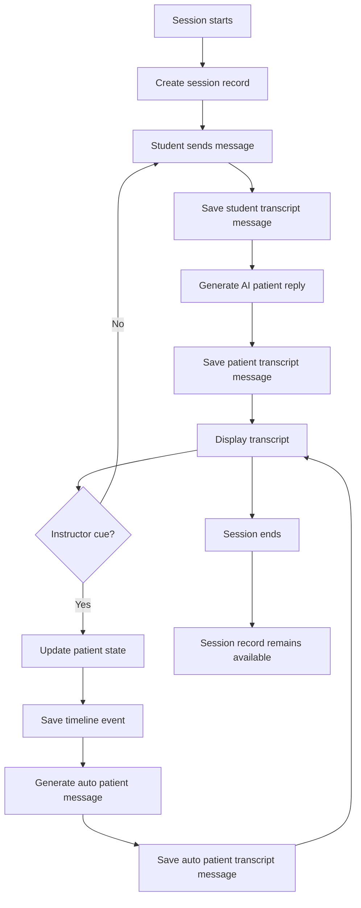
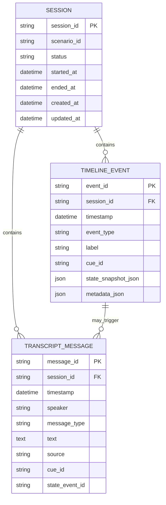
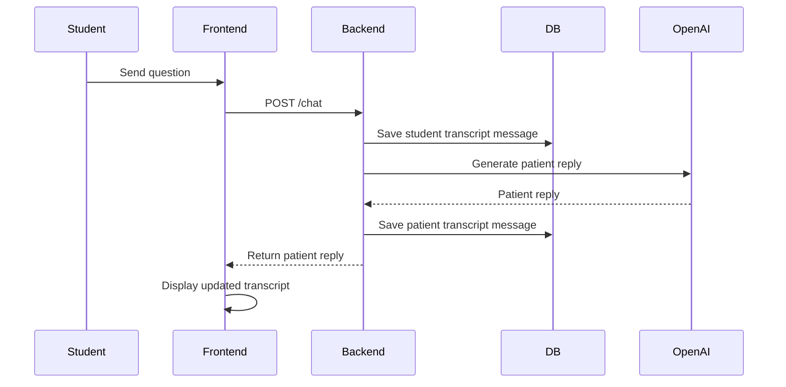
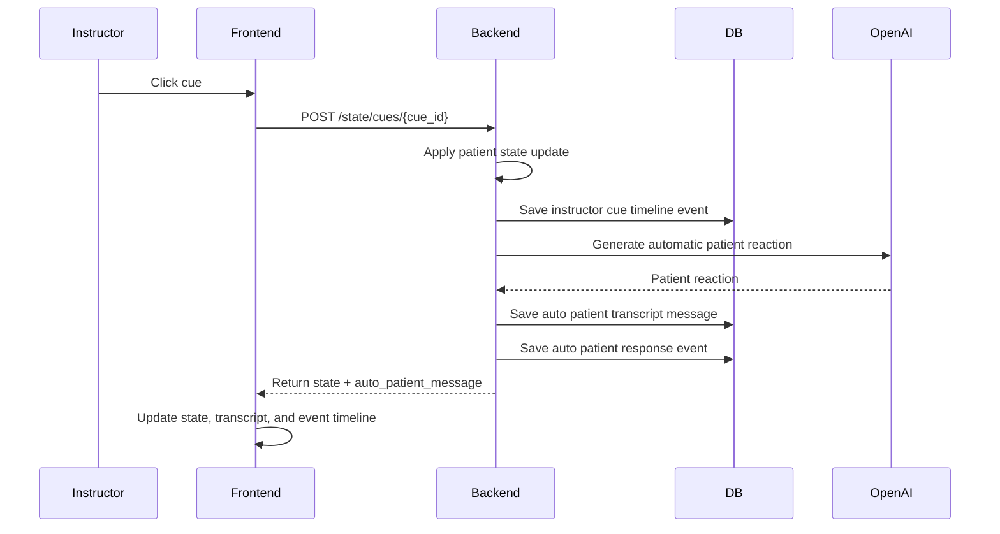

# Step 7: Transcript and Event Timeline Persistence

Date: July 1, 2026

## Why This Document Was Added

Step 7 is needed because the app now has meaningful simulation activity:

```text
student messages
AI patient responses
instructor cues
patient state changes
automatic patient reactions
```

At the end of Step 6.9, those interactions work during the live session, but they are not yet stored as a durable session record. Step 7 turns the demo from a live-only chatbot into a simulation record system that can support debriefing and final reports.

## Step 7 Goal

Store a session transcript and event timeline so the instructor can review what happened during and after the simulation.

The system should record:

- student questions
- AI patient responses
- automatic patient responses after instructor cues
- timestamps
- speaker labels
- instructor cue events
- state snapshots after cues
- session lifecycle events

## Product Value

Step 7 is valuable because simulation education depends on debriefing.

For the July 25 demo, this enables:

```text
Instructor runs scenario
Students interact with patient
Instructor applies cues
System records transcript and events
Instructor reviews the timeline after the session
```

For a future sellable product, this becomes the foundation for:

- debrief reports
- faculty review
- performance evidence
- audit trails
- quality improvement
- scenario analytics

## Scope

Step 7 will build:

- session model
- transcript message model
- event timeline model
- persistence service
- backend APIs to read transcript and events
- frontend display of persisted transcript and event timeline
- storage of `/chat` messages
- storage of instructor cue events
- storage of automatic patient responses
- basic session start/end lifecycle

Step 7 will not build:

- final debrief report generation
- grading or scoring
- authentication
- role-based access
- multi-user collaboration
- voice transcript from live audio
- direct SimCapture import
- direct Laerdal/LLEAP integration

## Important Product Boundary

The app still remains instructor-cued only.

```text
Laerdal/LLEAP/SimCapture state is not read automatically.
Instructor changes patient state in this dashboard.
This app records only what happens inside this AI patient persona system.
```

## Existing Starting Point

Current working behavior:

```text
Student sends chat message
Backend returns AI patient response
Instructor clicks cue button
Backend updates patient state
Backend returns automatic patient response
Frontend displays conversation and current state
```

Current limitation:

```text
Messages and events are visible only in memory during the running app.
If the server restarts or the page reloads, the historical record can be lost.
```

## Target Flow



## Persistence Strategy

For the July demo and future product direction, use PostgreSQL through a normal backend database abstraction.

Recommended approach:

```text
PostgreSQL + SQLAlchemy models + existing DATABASE_URL setting
```

Local development:

```text
Run PostgreSQL locally and connect through DATABASE_URL.
```

Production direction:

```text
Use managed or private-cloud PostgreSQL for deployed or multi-user use.
```

Why this approach:

- the existing backend already has `DATABASE_URL`
- PostgreSQL keeps the internship demo aligned with the production data model
- SQLAlchemy keeps database access organized while still using PostgreSQL from the start
- transcript/report features need structured queries later
- future multi-session, reporting, audit, and analytics features will fit PostgreSQL better than a local file database

Why not SQLite:

- The project is intended to grow beyond an internship prototype.
- Transcript and event data are core product records, not temporary demo-only data.
- PostgreSQL avoids a later database migration from SQLite assumptions.
- PostgreSQL is better suited for concurrent users, deployed environments, reporting queries, and production backup/retention workflows.

## Data Entities

### Session

Purpose:

Represent one simulation run.

Fields:

```text
session_id
scenario_id
status
started_at
ended_at
created_at
updated_at
```

Recommended statuses:

```text
active
paused
takeover
ended
```

### Transcript Message

Purpose:

Store every conversational message shown in the chat.

Fields:

```text
message_id
session_id
timestamp
speaker
message_type
text
source
cue_id
state_event_id
```

Speaker values:

```text
student
patient
system
instructor
```

Message type values:

```text
student_question
patient_reply
auto_patient_reaction
system_note
```

Source values:

```text
manual
openai
mock_fallback
system
```

### Timeline Event

Purpose:

Store important simulation events.

Fields:

```text
event_id
session_id
timestamp
event_type
label
cue_id
state_snapshot_json
metadata_json
```

Event type values:

```text
session_started
student_message
patient_response
instructor_cue
auto_patient_response
pause
resume
takeover_started
takeover_ended
intervention
session_ended
```

## Data Relationship



## API Design

### Start or Get Active Session

```text
POST /sessions/start
```

Purpose:

Create a session record if no active session exists.

Response:

```json
{
  "session_id": "session-...",
  "scenario_id": "copd-sob",
  "status": "active",
  "started_at": "2026-07-01T..."
}
```

### End Session

```text
POST /sessions/{session_id}/end
```

Purpose:

Mark the session as ended.

### Get Transcript

```text
GET /sessions/{session_id}/transcript
```

Purpose:

Return ordered transcript messages for debrief review.

### Get Event Timeline

```text
GET /sessions/{session_id}/events
```

Purpose:

Return ordered timeline events.

### Current Session Shortcut

For the July demo, a shortcut endpoint can be useful:

```text
GET /sessions/current
```

Purpose:

Let the frontend load the current active session without login or multi-user complexity.

## Backend File Plan

New files:

```text
codes/backend/app/db/__init__.py
codes/backend/app/db/session.py
codes/backend/app/models/__init__.py
codes/backend/app/models/session.py
codes/backend/app/models/transcript.py
codes/backend/app/models/timeline.py
codes/backend/app/schemas/session.py
codes/backend/app/services/session_service.py
codes/backend/app/services/transcript_service.py
codes/backend/app/services/timeline_service.py
codes/backend/app/api/sessions.py
```

Modified files:

```text
codes/backend/app/core/config.py
codes/backend/.env.example
codes/backend/app/api/chat.py
codes/backend/app/api/state.py
codes/backend/app/main.py
codes/backend/requirements.txt
codes/docs/Step7_Transcript_Event_Persistence.md
Progress_Report.md
```

## Frontend File Plan

New files:

```text
codes/frontend/src/api/sessions.ts
```

Modified files:

```text
codes/frontend/src/pages/Dashboard.tsx
codes/frontend/src/pages/Chat.tsx
codes/frontend/src/api/chat.ts
codes/frontend/src/api/state.ts
```

## File Responsibilities

### `db/session.py`

Purpose:

Create the database engine and session dependency.

Responsibilities:

- read `DATABASE_URL`
- create SQLAlchemy engine
- provide database sessions to API routes and services

### `models/session.py`

Purpose:

Define the database table for simulation sessions.

### `models/transcript.py`

Purpose:

Define the database table for chat transcript messages.

### `models/timeline.py`

Purpose:

Define the database table for simulation events.

### `services/session_service.py`

Purpose:

Create, retrieve, and end simulation sessions.

### `services/transcript_service.py`

Purpose:

Save and read ordered transcript messages.

### `services/timeline_service.py`

Purpose:

Save and read ordered timeline events.

### `api/sessions.py`

Purpose:

Expose session, transcript, and event APIs to the frontend.

## Integration Points

### Chat Route

Current behavior:

```text
POST /chat returns patient reply
```

Step 7 behavior:

```text
POST /chat
    save student message
    generate patient reply
    save patient reply
    return patient reply
```

### State Cue Route

Current behavior:

```text
POST /state/cues/{cue_id}
    update patient state
    generate auto patient message
    return state + auto_patient_message
```

Step 7 behavior:

```text
POST /state/cues/{cue_id}
    update patient state
    save instructor cue timeline event
    generate auto patient message
    save auto patient message in transcript
    save auto patient response timeline event
    return state + auto_patient_message
```

### Reset Route

Current behavior:

```text
POST /state/reset
```

Step 7 behavior:

```text
POST /state/reset
    reset current patient state
    create or restart active session
    save session_started or state_reset event
```

## Dashboard Design

The dashboard should show:

- current patient state
- instructor controls
- patient conversation transcript
- event timeline
- session status
- start/end session controls

Recommended layout for July demo:

```text
Header:
  Scenario name, session status, start/end/reset buttons

Left:
  Patient conversation transcript

Right:
  Current patient state
  Instructor cue buttons

Bottom:
  Event timeline
```

## Display Rules

Transcript should display:

```text
timestamp
speaker label
message text
message source when useful for debugging
```

Event timeline should display:

```text
timestamp
event label
cue label if present
important state values after cue
```

For the demo, avoid showing technical IDs in the main UI unless needed.

## Step 7 Substeps

### 7.1 Create Step 7 documentation

Create this planning document.

### 7.2 Add database dependency and database session foundation

Add PostgreSQL driver support, SQLAlchemy support, and create the backend database session helper.

Status:

```text
Completed
```

Files created:

```text
codes/backend/app/db/__init__.py
codes/backend/app/db/session.py
```

Files changed:

```text
codes/backend/requirements.txt
codes/backend/app/core/config.py
codes/backend/.env.example
codes/docs/Step7_Transcript_Event_Persistence.md
Progress_Report.md
```

What changed:

```text
requirements.txt:
Added SQLAlchemy==2.0.36.
Added psycopg[binary]==3.3.4.

config.py:
Confirmed DATABASE_URL is part of backend settings.
Set the default local database URL to PostgreSQL through the psycopg SQLAlchemy driver.

.env.example:
Updated DATABASE_URL example to use postgresql+psycopg.

db/__init__.py:
Created a database package for Step 7 persistence code.

db/session.py:
Created SQLAlchemy Base.
Created lazy engine factory.
Created lazy session factory.
Created FastAPI-compatible get_db dependency.
Created create_database_tables helper for future model table creation.
Added URL normalization so older postgresql:// URLs are converted to postgresql+psycopg://.
```

Why:

- Step 7 needs a real persistence foundation before session, transcript, and timeline tables can be added.
- SQLAlchemy gives a clean ORM layer and keeps the project ready for PostgreSQL.
- `psycopg` is the PostgreSQL driver used by SQLAlchemy.
- A shared `Base` lets future model files register tables consistently.
- A shared `get_db` dependency gives future API routes a safe way to open and close database sessions.
- Lazy engine/session creation prevents app import from immediately connecting to the database.
- URL normalization protects older local `.env` values that may still use `postgresql://`.

How it works:

```text
Future route or service asks FastAPI for get_db.
get_db reads DATABASE_URL from backend settings.
get_db gets a SQLAlchemy session factory for that URL.
The session is yielded to the route/service.
When the request finishes, the session closes automatically.
```

Important boundary:

```text
Step 7.2 does not create transcript tables yet.
Step 7.2 does not save chat messages yet.
Step 7.2 does not change /chat or /state behavior yet.
```

Verification:

```text
Installed SQLAlchemy 2.0.36 in codes/backend/.venv.
Installed psycopg 3.3.4 and psycopg-binary 3.3.4 in codes/backend/.venv.
Backend compile check passed.
SQLAlchemy SQLite smoke test passed for isolated engine/session behavior.
PostgreSQL URL normalization test passed and selected driver=psycopg.
```

### 7.3 Define persistence models

Create database models for:

- session
- transcript message
- timeline event

Status:

```text
Completed
```

Files created:

```text
codes/backend/app/models/__init__.py
codes/backend/app/models/session.py
codes/backend/app/models/transcript.py
codes/backend/app/models/timeline.py
```

File changed:

```text
codes/backend/app/db/session.py
```

What changed:

```text
models/__init__.py:
Created the app.models package and imported all persistence models so SQLAlchemy metadata can register them.

models/session.py:
Created SimulationSession model for the sessions table.
Fields: session_id, scenario_id, status, started_at, ended_at, created_at, updated_at.
Added relationships to transcript_messages and timeline_events.

models/transcript.py:
Created TranscriptMessage model for the transcript_messages table.
Fields: message_id, session_id, timestamp, speaker, message_type, text, source, cue_id, state_event_id.
Added relationship back to SimulationSession.
Added optional relationship to TimelineEvent through state_event_id.

models/timeline.py:
Created TimelineEvent model for the timeline_events table.
Fields: event_id, session_id, timestamp, event_type, label, cue_id, state_snapshot_json, metadata_json.
Added relationship back to SimulationSession.
Added relationship to transcript messages that are connected to a timeline event.

db/session.py:
Updated create_database_tables() so it imports app.models before calling Base.metadata.create_all().
```

Why:

- Step 7 needs database table definitions before services and APIs can save records.
- The session table represents one simulation run.
- The transcript table stores what was said during the simulation.
- The timeline table stores instructor cues, lifecycle events, and state snapshots.
- Relationships make it possible to retrieve all messages and events for one session later.
- Importing `app.models` before table creation ensures SQLAlchemy metadata knows about all model classes.

How it works:

```text
SimulationSession is the parent record.
TranscriptMessage rows belong to one SimulationSession.
TimelineEvent rows belong to one SimulationSession.
TranscriptMessage can optionally point to a TimelineEvent when a patient message was caused by an instructor cue.
```

Important implementation note:

```text
Nullable database columns are marked with nullable=True in mapped_column().
The model annotations avoid Python 3.14 nullable union syntax because SQLAlchemy 2.0.36 had trouble parsing it during mapper registration.
```

Verification:

```text
Backend compile check passed.
SQLAlchemy metadata registered these tables:
sessions
timeline_events
transcript_messages

In-memory SQLite smoke test created all three tables.
Health endpoint still returned 200 ok.
```

What was not changed:

```text
No session service was created yet.
No transcript service was created yet.
No timeline service was created yet.
No API route was changed.
No chat messages are being saved yet.
No instructor cues are being saved yet.
No real PostgreSQL tables were created yet.
```

### 7.4 Define session/transcript/timeline schemas

Create Pydantic schemas for API responses.

Status:

```text
Completed
```

File created:

```text
codes/backend/app/schemas/session.py
```

What changed:

```text
Added Literal types for persisted session status, transcript speaker, transcript message type, transcript source, and timeline event type.

Added session schemas:
SessionStartRequest
SessionResponse
CurrentSessionResponse

Added transcript schemas:
TranscriptMessageCreate
TranscriptMessageResponse
TranscriptResponse

Added timeline schemas:
TimelineEventCreate
TimelineEventResponse
TimelineResponse
```

Why:

- Step 7.3 created database models, but API routes should not expose raw SQLAlchemy models directly.
- Pydantic schemas define the clean request and response contracts for future session, transcript, and event endpoints.
- Literal types prevent invalid speaker labels, message types, sources, event types, and session statuses from silently entering the API layer.
- `ConfigDict(from_attributes=True)` allows response schemas to be built from SQLAlchemy model objects in later service/API steps.

How it works:

```text
Services will create or read SQLAlchemy model objects.
API routes will convert those objects into Pydantic response schemas.
Frontend code will receive predictable JSON fields.
```

Important schema groups:

```text
SessionResponse:
Represents one simulation session.

TranscriptMessageResponse:
Represents one persisted chat/transcript message.

TimelineEventResponse:
Represents one persisted simulation event.

TranscriptResponse:
Wraps all transcript messages for one session.

TimelineResponse:
Wraps all timeline events for one session.
```

Verification:

```text
Backend compile check passed.
Sample SessionResponse validation passed.
Sample TranscriptMessageResponse validation passed.
Sample TimelineEventResponse validation passed.
Health endpoint still returned 200 ok.
```

What was not changed:

```text
No database service was created yet.
No session API route was created yet.
No /chat behavior was changed.
No /state behavior was changed.
No transcript or timeline records are saved yet.
```

### 7.5 Create session service

Add functions to:

- create active session
- get active session
- end session

### 7.6 Create transcript service

Add functions to:

- save transcript message
- list transcript messages

### 7.7 Create timeline service

Add functions to:

- save timeline event
- list timeline events

### 7.8 Add sessions API route

Expose:

```text
POST /sessions/start
GET /sessions/current
POST /sessions/{session_id}/end
GET /sessions/{session_id}/transcript
GET /sessions/{session_id}/events
```

### 7.9 Connect `/chat` to transcript persistence

Save:

- student message before AI response
- patient reply after AI response

### 7.10 Connect state cues to timeline and transcript persistence

Save:

- instructor cue event
- state snapshot
- automatic patient response

### 7.11 Connect frontend to persisted transcript and events

Load transcript and events from backend instead of relying only on local component state.

### 7.12 Verify Step 7 end to end

Test:

```text
start session
send chat message
apply instructor cue
see auto patient response
reload page
confirm transcript remains visible
end session
confirm transcript/events remain available
```

## Mermaid Sequence: Chat Persistence



## Mermaid Sequence: Cue Persistence



## Success Criteria

Step 7 is complete when:

- a session record can be started
- a session record can be ended
- student messages are saved
- AI patient replies are saved
- automatic patient reactions are saved
- instructor cue events are saved
- patient state snapshots after cues are saved
- transcript is visible during the session
- event timeline is visible during the session
- transcript remains available after page reload
- events remain available after page reload
- transcript and events remain available after session end
- no API keys or sensitive values are stored in transcript records

## Testing Plan

Backend tests:

```text
create session
get current session
save transcript message
list transcript messages
save timeline event
list timeline events
POST /chat saves student and patient messages
POST /state/cues/{cue_id} saves cue event and auto patient message
end session
```

Frontend tests/manual verification:

```text
open dashboard
start/reset session
send student message
confirm patient reply appears
click SpO2 dropped
confirm state changes
confirm automatic patient response appears
confirm event timeline updates
reload page
confirm transcript and timeline still appear
end session
confirm records are still readable
```

## Security and Privacy Notes

For the demo:

- do not store real patient information
- use fictional scenario data only
- do not store OpenAI API keys in database records
- do not expose backend `.env` values to frontend
- label reports as simulation/debrief support only

For production later:

- add authentication
- add role-based access
- encrypt sensitive data at rest if required
- define data retention policy
- add audit logs for access
- consider FERPA/HIPAA/privacy review depending on deployment context and data collected

## Risks

### Risk: Too much database work slows demo progress

Mitigation:

Keep Step 7 focused on three tables only:

```text
sessions
transcript_messages
timeline_events
```

### Risk: Transcript becomes inconsistent with UI

Mitigation:

Use backend persistence as source of truth after Step 7.

### Risk: OpenAI failure prevents transcript saving

Mitigation:

Save the student message before calling OpenAI and save mock fallback patient response if OpenAI fails.

### Risk: Multi-session complexity grows too early

Mitigation:

Support one active local session for the July demo, but design IDs and tables so multi-session support can be added later.

## Recommended Step 7 Implementation Order

```text
7.1 Documentation
7.2 Database foundation
7.3 Models
7.4 Schemas
7.5 Session service
7.6 Transcript service
7.7 Timeline service
7.8 Sessions API
7.9 Persist chat
7.10 Persist state cues and auto patient responses
7.11 Frontend transcript/event loading
7.12 End-to-end verification
```

## What To Avoid In Step 7

Do not add:

- final report generation
- authentication
- voice transcription
- Laerdal integration
- multi-scenario editor
- grading logic
- complex analytics

Those are later steps. Step 7 should make the simulation record reliable first.
