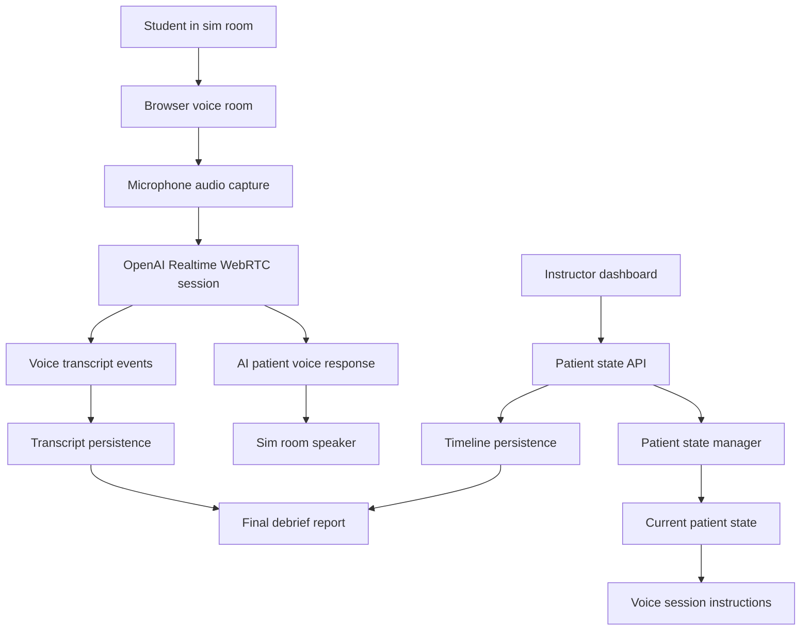
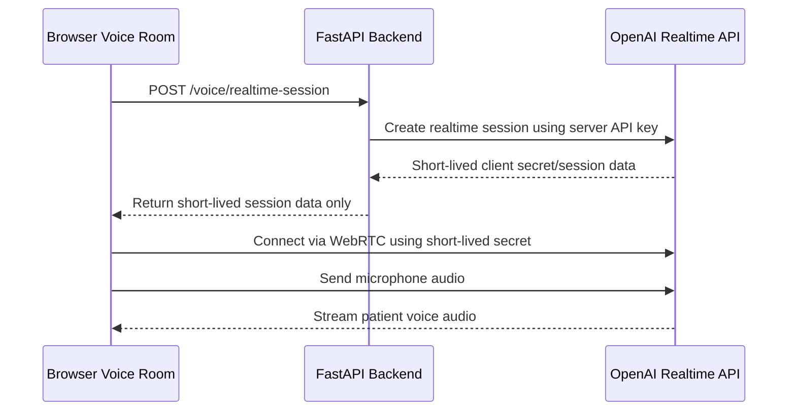
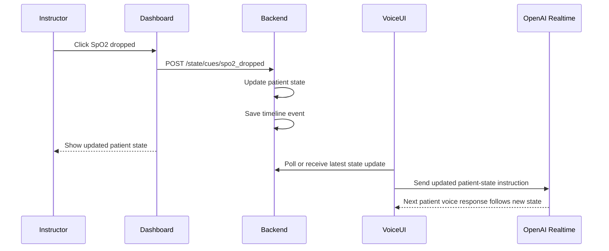

# Step 9: Voice Interaction

Date: July 3, 2026

## Why This Document Was Added

Steps 6 through 8 created a strong text-based product foundation:

```text
OpenAI text patient persona
instructor-cued patient state changes
automatic patient reactions after state changes
persistent transcript and event timeline
final debrief-support report
```

Step 9 adds real voice interaction so students can speak to the AI patient and hear the patient respond aloud during the simulation.

## Step 9 Goal

Add secure browser-based voice interaction to the existing instructor-cued AI patient system.

The goal is:

```text
student speaks in the sim room
browser captures student audio
OpenAI Realtime voice model responds as the patient
student hears the patient response through the room speaker
instructor continues controlling patient condition through dashboard cues
voice transcript and state events remain available for the final report
```

## Product Value

Voice is the feature that makes this project feel like a realistic simulation patient instead of only a chatbot.

For the July 25 demo, voice should show:

- students can speak naturally to the AI patient
- the AI patient responds out loud
- instructor cues still change the patient condition
- the patient voice follows the latest patient state
- transcript and events remain part of the debrief record

For a future sellable product, voice is one of the main differentiators because it can reduce how much the instructor needs to manually speak as the manikin.

## Scope

Step 9 will build:

- secure backend voice session endpoint
- browser-based voice room
- microphone permission flow
- speaker playback flow
- OpenAI Realtime connection through browser WebRTC
- patient persona instructions for voice
- current patient state included in voice instructions
- instructor-cued state updates reflected in voice behavior
- basic voice transcript persistence
- visible voice connection status
- safety controls for pause, mute, and instructor takeover
- end-to-end voice verification

Step 9 will not build:

- direct Laerdal, LLEAP, SimCapture, or manikin integration
- automatic reading of manikin vital signs
- clinical grading
- real patient data usage
- production authentication
- hospital network deployment
- advanced audio routing hardware management
- phone-call support
- PDF or DOCX voice reports

## Important Product Boundary

The system remains instructor-cued.

```text
The AI voice persona does not know that heart rate, SpO2, breathing effort, or other patient conditions changed unless the instructor updates the AI patient state through the dashboard.
```

The instructor still controls:

- the Laerdal/manikin software separately
- manikin physiological behavior separately
- AI patient state through this project dashboard

The AI voice patient uses:

- scenario persona
- current patient state stored in this app
- latest instructor cues
- safety rules
- student speech input

## Lab Audio Setup

Recommended July demo setup:

```text
Sim room:
  one laptop/tablet/browser running the student voice room
  external microphone if available
  external speaker near the manikin if available

Control room:
  instructor laptop running the instructor dashboard
  instructor uses dashboard buttons to update AI patient state
  instructor can pause/mute/take over if needed
```

Students should speak toward the sim-room microphone. The AI patient response should play through the sim-room speaker so it sounds like the patient/manikin is answering.

The instructor does not need to speak through the AI system during normal voice mode. The instructor only updates state and safety controls from the dashboard.

## Audio Hardware Recommendation

For the demo:

- laptop built-in microphone and speaker can work for testing
- an external USB speaker improves patient voice clarity
- an external USB microphone improves student speech capture
- keep the speaker close to the manikin if possible
- avoid placing the microphone directly beside the speaker to reduce echo

For future productization:

- use a dedicated room microphone
- use a dedicated patient speaker near the manikin
- support device selection in the browser
- test echo cancellation and noise suppression
- document recommended hardware packages

## Voice Architecture



## Secure Realtime Session Architecture

The frontend must never receive the permanent OpenAI API key.

Recommended pattern:

```text
backend stores OpenAI API key in .env
frontend asks backend for a short-lived realtime session
backend creates a short-lived OpenAI Realtime session/token
frontend uses only the short-lived token in the browser
browser connects directly to OpenAI Realtime with WebRTC
```



## Current Patient State in Voice

Voice responses must reflect the latest patient state.

State values that should influence voice:

```text
stage
heart rate
SpO2
respiratory rate
breathing effort
chest tightness
anxiety
fatigue
oxygen applied
bronchodilator given
AI paused
instructor takeover
```

Example:

```text
If breathing_effort is severe and anxiety is high:
  patient should speak in shorter, more breathless, more anxious phrases.

If oxygen_applied is true and patient_improving was cued:
  patient may sound calmer and report slightly easier breathing.
```

## Instructor-Cued State Update During Voice

Voice must support on-the-way condition changes.



Initial implementation can use polling or manual refresh for state updates.

Better later implementation:

```text
Use WebSockets so the voice room receives instructor cue changes immediately.
```

## Voice Safety Controls

Required controls:

- pause AI patient
- resume AI patient
- mute microphone
- disconnect voice session
- instructor takeover mode

Behavior:

```text
Pause:
  AI patient should stop responding.

Mute:
  browser should stop sending microphone audio.

Instructor takeover:
  AI patient should stop speaking so the instructor can speak manually if needed.

Disconnect:
  voice session ends and microphone stream stops.
```

## Transcript and Event Persistence

Voice should preserve the Step 7 record:

```text
student speech transcript
AI patient voice response transcript
instructor cues
state snapshots
pause/resume/takeover events
session end
```

Initial Step 9 transcript plan:

- save text transcript events returned by Realtime when available
- label student speech as `student`
- label AI voice response as `patient`
- label source as `openai_realtime` if supported by schema update
- connect instructor-cued auto reactions to timeline events when possible

If full transcript extraction is not stable in the first implementation:

```text
Keep voice interaction working first.
Then persist voice transcript in the next small substep.
```

## Security and Privacy Rules

Rules:

- never put the OpenAI API key in frontend code
- never print API keys in terminal output
- never store API keys in Markdown files
- use `.env` only on the backend
- keep `.env` ignored by Git
- use fictional patient data only
- do not use real patient names or protected health information
- clearly label output as simulation
- do not let the AI provide treatment orders
- do not let the AI grade students

Voice-specific privacy:

```text
Do not record or store real student names unless the institution explicitly approves it.
For the internship demo, use fictional student names or no student names.
```

## Backend File Plan

Likely new files:

```text
codes/backend/app/api/voice.py
codes/backend/app/services/realtime_voice_service.py
codes/backend/app/schemas/voice.py
```

Likely modified files:

```text
codes/backend/app/main.py
codes/backend/app/schemas/session.py
codes/backend/app/services/transcript_service.py
codes/docs/Step9_Voice_Interaction.md
Progress_Report.md
```

## Frontend File Plan

Likely new files:

```text
codes/frontend/src/api/voice.ts
codes/frontend/src/pages/VoiceRoom.tsx
```

Likely modified files:

```text
codes/frontend/src/App.tsx
codes/frontend/src/pages/Dashboard.tsx
codes/frontend/src/styles.css
```

## Step 9 Substeps

### 9.1 Create Step 9 voice interaction documentation

Create this planning document.

### 9.2 Define production voice architecture

Document exact backend/frontend responsibilities before coding.

### 9.3 Add secure backend realtime-session endpoint

Create backend endpoint that returns a short-lived Realtime session/client secret.

Success criteria:

```text
frontend never sees permanent OpenAI API key
backend can request realtime session from OpenAI
endpoint returns only short-lived session data
```

### 9.4 Add frontend voice API client

Create a frontend function that calls the backend voice session endpoint.

### 9.5 Add voice room UI

Create a browser page for:

- connect voice
- disconnect voice
- mute microphone
- show connection status
- show current patient state summary
- show voice transcript when available

### 9.6 Connect browser microphone and speaker

Use browser WebRTC to:

- request microphone permission
- send microphone audio to Realtime session
- play patient voice audio through speaker

### 9.7 Send patient persona and current state to voice session

Build voice instructions from:

- COPD/SOB scenario
- patient profile
- safety rules
- current patient state
- instructor-cued state changes

### 9.8 Support state changes during active voice session

When instructor changes patient state:

- update dashboard state
- persist timeline event
- update voice session instructions
- make next patient response reflect new condition

### 9.9 Persist voice transcript and voice events

Save:

- student speech transcript
- patient voice response transcript
- voice connected/disconnected events
- mute/pause/takeover events

### 9.10 Add safety controls

Implement:

- pause AI
- resume AI
- mute microphone
- instructor takeover
- disconnect session

### 9.11 Verify voice end to end

Test:

```text
open dashboard
open voice room
connect voice
speak as student
hear AI patient response
apply instructor cue
confirm patient response changes
confirm transcript/event record
end session
generate final report
```

## Acceptance Criteria

Step 9 is complete when:

- voice room connects securely without exposing API key
- browser microphone sends audio
- browser speaker plays patient voice
- patient voice uses COPD/SOB persona
- voice response follows current patient state
- instructor cue changes influence future voice responses
- voice can be paused or disconnected
- no real patient data is used
- transcript/events are saved when technically available
- Step 8 final report remains functional

## Main Risks

### Risk: API key exposure

Mitigation:

Use backend-created short-lived Realtime sessions only.

### Risk: browser microphone permissions fail

Mitigation:

Show clear connection status and keep text chat available as backup.

### Risk: audio echo or feedback

Mitigation:

Use headphones during testing or separate microphone/speaker placement in the sim room.

### Risk: voice does not update after instructor cue

Mitigation:

Start with manual/polling state refresh, then upgrade to WebSockets.

### Risk: July timeline pressure

Mitigation:

Implement the smallest valuable voice demo first:

```text
connect voice
student speaks
patient responds aloud
instructor cue changes the next patient response
```

Then add persistence and polish.

## Recommended First Implementation Target

Start with:

```text
9.3 secure backend realtime-session endpoint
9.4 frontend voice API client
9.5 simple voice room UI
9.6 microphone and speaker connection
```

This creates a minimal working voice path while keeping the rest of the product safe.

