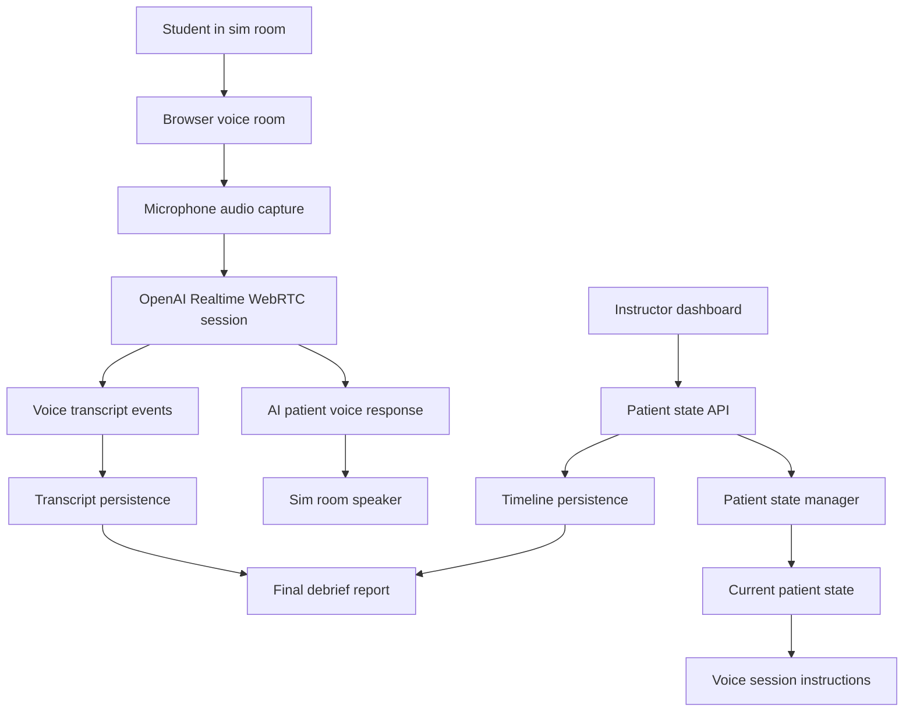
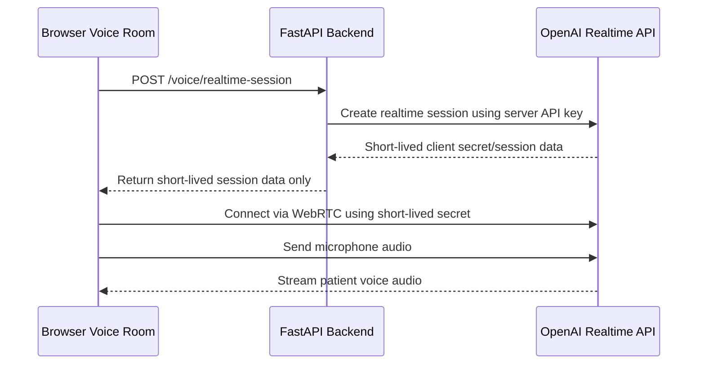
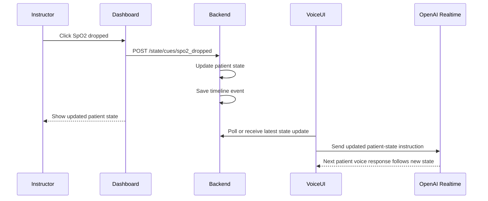
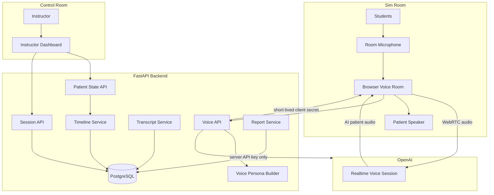
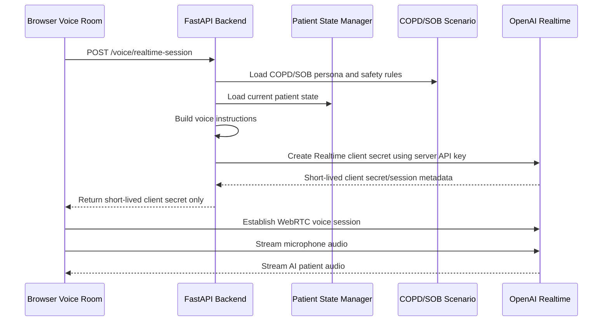
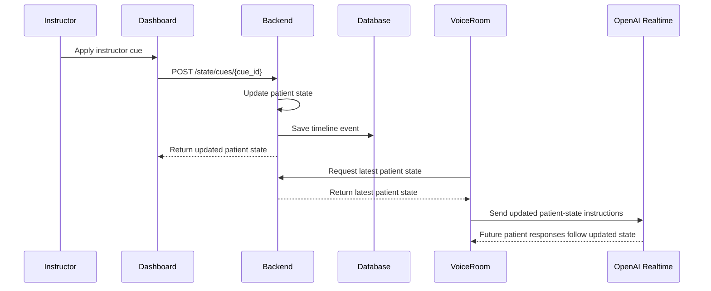

# Step 9: Voice Interaction

Date: July 3, 2026

## Why This Document Was Added

Steps 6 through 8 created a strong text-based product foundation:

```text
OpenAI text patient persona
instructor-cued patient state changes
automatic patient reactions after state changes
persistent transcript and event timeline
final debrief-support report
```

Step 9 adds real voice interaction so students can speak to the AI patient and hear the patient respond aloud during the simulation.

## Step 9 Goal

Add secure browser-based voice interaction to the existing instructor-cued AI patient system.

The goal is:

```text
student speaks in the sim room
browser captures student audio
OpenAI Realtime voice model responds as the patient
student hears the patient response through the room speaker
instructor continues controlling patient condition through dashboard cues
voice transcript and state events remain available for the final report
```

## Product Value

Voice is the feature that makes this project feel like a realistic simulation patient instead of only a chatbot.

For the July 25 demo, voice should show:

- students can speak naturally to the AI patient
- the AI patient responds out loud
- instructor cues still change the patient condition
- the patient voice follows the latest patient state
- transcript and events remain part of the debrief record

For a future sellable product, voice is one of the main differentiators because it can reduce how much the instructor needs to manually speak as the manikin.

## Scope

Step 9 will build:

- secure backend voice session endpoint
- browser-based voice room
- microphone permission flow
- speaker playback flow
- OpenAI Realtime connection through browser WebRTC
- patient persona instructions for voice
- current patient state included in voice instructions
- instructor-cued state updates reflected in voice behavior
- basic voice transcript persistence
- visible voice connection status
- safety controls for pause, mute, and instructor takeover
- end-to-end voice verification

Step 9 will not build:

- direct Laerdal, LLEAP, SimCapture, or manikin integration
- automatic reading of manikin vital signs
- clinical grading
- real patient data usage
- production authentication
- hospital network deployment
- advanced audio routing hardware management
- phone-call support
- PDF or DOCX voice reports

## Important Product Boundary

The system remains instructor-cued.

```text
The AI voice persona does not know that heart rate, SpO2, breathing effort, or other patient conditions changed unless the instructor updates the AI patient state through the dashboard.
```

The instructor still controls:

- the Laerdal/manikin software separately
- manikin physiological behavior separately
- AI patient state through this project dashboard

The AI voice patient uses:

- scenario persona
- current patient state stored in this app
- latest instructor cues
- safety rules
- student speech input

## Lab Audio Setup

Recommended July demo setup:

```text
Sim room:
  one laptop/tablet/browser running the student voice room
  external microphone if available
  external speaker near the manikin if available

Control room:
  instructor laptop running the instructor dashboard
  instructor uses dashboard buttons to update AI patient state
  instructor can pause/mute/take over if needed
```

Students should speak toward the sim-room microphone. The AI patient response should play through the sim-room speaker so it sounds like the patient/manikin is answering.

The instructor does not need to speak through the AI system during normal voice mode. The instructor only updates state and safety controls from the dashboard.

## Audio Hardware Recommendation

For the demo:

- laptop built-in microphone and speaker can work for testing
- an external USB speaker improves patient voice clarity
- an external USB microphone improves student speech capture
- keep the speaker close to the manikin if possible
- avoid placing the microphone directly beside the speaker to reduce echo

For future productization:

- use a dedicated room microphone
- use a dedicated patient speaker near the manikin
- support device selection in the browser
- test echo cancellation and noise suppression
- document recommended hardware packages

## Voice Architecture



## Secure Realtime Session Architecture

The frontend must never receive the permanent OpenAI API key.

Recommended pattern:

```text
backend stores OpenAI API key in .env
frontend asks backend for a short-lived realtime session
backend creates a short-lived OpenAI Realtime session/token
frontend uses only the short-lived token in the browser
browser connects directly to OpenAI Realtime with WebRTC
```



## Current Patient State in Voice

Voice responses must reflect the latest patient state.

State values that should influence voice:

```text
stage
heart rate
SpO2
respiratory rate
breathing effort
chest tightness
anxiety
fatigue
oxygen applied
bronchodilator given
AI paused
instructor takeover
```

Example:

```text
If breathing_effort is severe and anxiety is high:
  patient should speak in shorter, more breathless, more anxious phrases.

If oxygen_applied is true and patient_improving was cued:
  patient may sound calmer and report slightly easier breathing.
```

## Instructor-Cued State Update During Voice

Voice must support on-the-way condition changes.



Initial implementation can use polling or manual refresh for state updates.

Better later implementation:

```text
Use WebSockets so the voice room receives instructor cue changes immediately.
```

## Voice Safety Controls

Required controls:

- pause AI patient
- resume AI patient
- mute microphone
- disconnect voice session
- instructor takeover mode

Behavior:

```text
Pause:
  AI patient should stop responding.

Mute:
  browser should stop sending microphone audio.

Instructor takeover:
  AI patient should stop speaking so the instructor can speak manually if needed.

Disconnect:
  voice session ends and microphone stream stops.
```

## Transcript and Event Persistence

Voice should preserve the Step 7 record:

```text
student speech transcript
AI patient voice response transcript
instructor cues
state snapshots
pause/resume/takeover events
session end
```

Initial Step 9 transcript plan:

- save text transcript events returned by Realtime when available
- label student speech as `student`
- label AI voice response as `patient`
- label source as `openai_realtime` if supported by schema update
- connect instructor-cued auto reactions to timeline events when possible

If full transcript extraction is not stable in the first implementation:

```text
Keep voice interaction working first.
Then persist voice transcript in the next small substep.
```

## Security and Privacy Rules

Rules:

- never put the OpenAI API key in frontend code
- never print API keys in terminal output
- never store API keys in Markdown files
- use `.env` only on the backend
- keep `.env` ignored by Git
- use fictional patient data only
- do not use real patient names or protected health information
- clearly label output as simulation
- do not let the AI provide treatment orders
- do not let the AI grade students

Voice-specific privacy:

```text
Do not record or store real student names unless the institution explicitly approves it.
For the internship demo, use fictional student names or no student names.
```

## Backend File Plan

Likely new files:

```text
codes/backend/app/api/voice.py
codes/backend/app/services/realtime_voice_service.py
codes/backend/app/schemas/voice.py
```

Likely modified files:

```text
codes/backend/app/main.py
codes/backend/app/schemas/session.py
codes/backend/app/services/transcript_service.py
codes/docs/Step9_Voice_Interaction.md
Progress_Report.md
```

## Frontend File Plan

Likely new files:

```text
codes/frontend/src/api/voice.ts
codes/frontend/src/pages/VoiceRoom.tsx
```

Likely modified files:

```text
codes/frontend/src/App.tsx
codes/frontend/src/pages/Dashboard.tsx
codes/frontend/src/styles.css
```

## Step 9 Substeps

### 9.1 Create Step 9 voice interaction documentation

Create this planning document.

### 9.2 Define production voice architecture

Document exact backend/frontend responsibilities before coding.

Implemented on July 3, 2026:

```text
Defined the production voice architecture for the first integrated voice implementation.
```

References checked:

```text
OpenAI Realtime and audio guide:
https://developers.openai.com/api/docs/guides/realtime

OpenAI Realtime client secrets API reference:
https://developers.openai.com/api/reference/resources/realtime/subresources/client_secrets
```

What was defined:

- browser voice room responsibility
- FastAPI backend responsibility
- OpenAI Realtime responsibility
- patient state responsibility
- transcript and timeline persistence boundary
- security boundary for the OpenAI API key
- first implementation path versus later production upgrades

Why:

- voice is the riskiest and most valuable feature, so the architecture must be clear before coding
- the frontend must never receive the permanent OpenAI API key
- the instructor dashboard and student voice room are separate browser experiences
- the AI patient remains instructor-cued and does not directly read Laerdal/manikin state
- Step 7 and Step 8 persistence/reporting must keep working after voice is added

How:

- the backend will expose a voice session endpoint
- the frontend voice room will request a short-lived Realtime client secret from the backend
- the frontend will use browser WebRTC for microphone capture and speaker playback
- the backend will build patient instructions from the COPD/SOB scenario and current patient state
- instructor cues will update this app's patient state first
- voice session instructions will be refreshed after patient state changes
- transcript and event persistence will be added after the minimal voice loop is stable

Files changed for 9.2:

```text
codes/docs/Step9_Voice_Interaction.md
Progress_Report.md
```

No production code was changed in this substep.

## 9.2 Production Voice Architecture

### Architecture Decision

Use a browser-based WebRTC voice session for the student voice room.

```text
Student voice room:
  captures microphone audio
  sends audio to OpenAI Realtime using WebRTC
  plays AI patient voice through the sim-room speaker

Backend:
  stores permanent OpenAI API key securely
  creates short-lived Realtime client secrets
  builds patient persona/state instructions
  exposes patient state and persistence APIs

Instructor dashboard:
  controls patient state
  applies scenario cues
  pauses or takes over the AI patient when needed

OpenAI Realtime:
  receives student audio
  returns AI patient audio
  emits conversation events/transcript data when available
```

Reason:

- WebRTC is the right fit for browser microphone and speaker workflows
- a direct browser audio path reduces latency
- the backend-only key pattern protects the permanent API key
- the architecture can scale later without rewriting the text chat, state manager, transcript, or report modules

### Production Component Diagram



### Backend Responsibilities

The backend owns:

- permanent OpenAI API key
- short-lived Realtime client secret creation
- voice session configuration
- scenario/persona loading
- current patient state loading
- patient instruction building
- transcript persistence
- event timeline persistence
- report compatibility
- future authentication and role checks

The backend must not:

- send the permanent OpenAI API key to the frontend
- log the API key
- require students to have OpenAI accounts
- directly control Laerdal/LLEAP/manikin software

### Frontend Responsibilities

The frontend voice room owns:

- microphone permission request
- microphone stream capture
- WebRTC peer connection setup
- patient voice audio playback
- connection status display
- mute/disconnect controls
- visible patient state summary
- display of voice transcript when available

The frontend must not:

- contain the permanent OpenAI API key
- generate clinical grades
- store secrets in local storage
- directly read the database
- directly control manikin software

### Instructor Dashboard Responsibilities

The instructor dashboard owns:

- cue buttons
- current patient state display
- pause/resume controls
- instructor takeover control
- end session workflow
- final report workflow

Important:

```text
The instructor dashboard changes this app's AI patient state.
The instructor still separately controls the Laerdal/manikin dashboard.
```

### Voice Session Creation Flow



### State Update During Active Voice Flow



Initial implementation:

```text
Voice room polls or manually refreshes patient state.
```

Later production upgrade:

```text
Backend pushes state updates to voice room through WebSockets.
```

Reason:

- polling/manual refresh is safer for a July demo
- WebSockets are better later for production responsiveness
- the architecture leaves room for both

### Instruction-Building Boundary

Voice instructions should be built from:

```text
scenario patient profile
chief complaint
allowed disclosures
hidden information rules
safety rules
current patient state
latest instructor cues
voice behavior rules
```

The voice persona must:

- speak only as the simulated patient
- keep responses short when respiratory distress is high
- avoid treatment orders
- avoid grading or evaluating students
- avoid revealing hidden clinical information unless allowed
- follow latest instructor-cued state
- remain fictional and simulation-only

### Data Persistence Boundary

Step 9 should preserve the existing data flow:

```text
sessions
transcript_messages
timeline_events
final report
```

Voice transcript persistence should be added carefully:

- student speech transcript should become a `student` transcript message
- AI patient voice transcript should become a `patient` transcript message
- voice connection events should become timeline events
- instructor safety controls should become timeline events

The first voice loop can work before full transcript persistence, but persistence must be added before considering Step 9 complete.

### Security Boundary

Security rules for the architecture:

- backend `.env` stores the permanent API key
- `.env` remains ignored by Git
- backend requests short-lived Realtime client secrets
- frontend receives only the short-lived secret
- frontend does not store the secret permanently
- no key is printed in terminal output
- no key is written to Markdown
- no real patient data is used
- voice report content remains debrief support only

### First Implementation Architecture

Build this first:

```text
POST /voice/realtime-session
frontend voice API client
VoiceRoom page
connect/disconnect button
microphone permission
speaker playback
basic patient voice instructions
manual state refresh before/while connected
```

Do not build first:

```text
WebSocket state push
complex device selector
production authentication
voice analytics
grading
Laerdal integration
PDF/DOCX voice report export
```

### Production Upgrade Path

After the July demo:

```text
add auth and role-based access
add WebSocket state push
add device selector
add transcript persistence from Realtime events
add voice audit events
add better instructor takeover workflow
add deployment secrets manager
add rate limiting
add monitoring and cost controls
add institutional privacy review
```

### 9.3 Add secure backend realtime-session endpoint

Create backend endpoint that returns a short-lived Realtime session/client secret.

Success criteria:

```text
frontend never sees permanent OpenAI API key
backend can request realtime session from OpenAI
endpoint returns only short-lived session data
```

Implemented on July 3, 2026:

```text
Added a secure backend endpoint for creating short-lived OpenAI Realtime voice sessions.
```

Files changed for 9.3:

```text
codes/backend/app/core/config.py
codes/backend/app/schemas/voice.py
codes/backend/app/services/realtime_voice_service.py
codes/backend/app/api/voice.py
codes/backend/app/main.py
codes/backend/requirements.txt
codes/docs/Step9_Voice_Interaction.md
Progress_Report.md
```

What changed:

- added backend Realtime configuration values
- added `RealtimeSessionResponse` schema
- added `create_realtime_voice_session()` service
- added `POST /voice/realtime-session`
- registered the voice router in the main FastAPI app
- added `httpx` as an explicit backend dependency

Why:

- the frontend needs a safe way to start a voice session
- the permanent OpenAI API key must stay on the backend
- the browser should receive only a short-lived Realtime client secret
- the voice session should be configured with the COPD/SOB persona and current patient state
- this endpoint prepares the project for the Step 9 browser voice room without touching the existing chat/report flow

How:

```text
Frontend will call POST /voice/realtime-session
FastAPI route calls create_realtime_voice_session()
service loads COPD/SOB scenario
service loads current patient state
service builds voice instructions
service sends server-side request to OpenAI Realtime client secret endpoint
service returns only short-lived client secret response fields to frontend
```

Endpoint:

```text
POST /voice/realtime-session
```

Response shape:

```json
{
  "client_secret": "short-lived-client-secret-from-openai",
  "expires_at": 1790000000,
  "session_id": "sess_...",
  "model": "gpt-realtime-2",
  "voice": "marin",
  "scenario_id": "copd-sob",
  "connect_url": "https://api.openai.com/v1/realtime/calls"
}
```

Security boundary:

```text
The endpoint never returns the permanent OpenAI API key.
The permanent key is read only by the backend service.
The key is not logged.
The key is not written to Markdown.
The key is not placed in frontend code.
```

Error behavior:

```text
If the OpenAI API key is missing, the endpoint returns 503.
If the OpenAI client-secret request fails, the endpoint returns 503.
```

Important implementation note:

```text
The service uses a direct backend HTTP request to OpenAI's Realtime client-secret endpoint through httpx.
This avoids depending on a specific OpenAI Python client method for this new Realtime endpoint.
```

Verification completed:

```text
python -m compileall app
```

Confirmed route registration:

```text
/voice/realtime-session ['POST'] RealtimeSessionResponse
```

Mocked service verification:

```text
mocked realtime session service verification passed
returned_client_secret_only=short-lived-test-secret
```

Verification boundary:

```text
No real OpenAI request was made during verification.
The outbound HTTP call was mocked.
No API key was printed.
No .env file was opened.
```

### 9.4 Add frontend voice API client

Create a frontend function that calls the backend voice session endpoint.

Implemented on July 3, 2026:

```text
Added the frontend API client for requesting a short-lived Realtime voice session.
```

Files changed for 9.4:

```text
codes/frontend/src/api/voice.ts
codes/docs/Step9_Voice_Interaction.md
Progress_Report.md
```

What changed:

- added `RealtimeSessionResponse` TypeScript type
- added `createRealtimeVoiceSession()`
- connected the frontend client to `POST /voice/realtime-session`
- added frontend error handling when the backend voice session request fails

Why:

- the future Voice Room page needs one clean function for starting a voice session
- the frontend should know the exact response shape from the backend
- TypeScript should catch mismatches before runtime
- the browser should request short-lived session data from the backend, not call OpenAI using the permanent API key

How:

```typescript
export async function createRealtimeVoiceSession(): Promise<RealtimeSessionResponse> {
  const response = await fetch(`${API_BASE_URL}/voice/realtime-session`, {
    method: "POST",
  });

  if (!response.ok) {
    throw new Error(
      `Realtime voice session request failed with status ${response.status}`,
    );
  }

  return response.json();
}
```

Security boundary:

```text
The frontend voice client does not contain the permanent OpenAI API key.
The frontend voice client calls only the backend.
The frontend voice client receives only short-lived session data.
The frontend voice client does not store secrets.
```

Verification:

```text
npm run build
python -m compileall app
```

Verification result:

```text
Frontend TypeScript production build passed.
Backend compile check passed.
```

### 9.5 Add voice room UI

Create a browser page for:

- connect voice
- disconnect voice
- mute microphone
- show connection status
- show current patient state summary
- show voice transcript when available

Implemented on July 3, 2026:

```text
Added the first integrated Voice Room page at /voice.
```

Files changed for 9.5:

```text
codes/frontend/src/App.tsx
codes/frontend/src/pages/Dashboard.tsx
codes/frontend/src/pages/VoiceRoom.tsx
codes/frontend/src/styles.css
codes/docs/Step9_Voice_Interaction.md
Progress_Report.md
```

What changed:

- added `VoiceRoom` page
- added `/voice` route selection in `App.tsx`
- added an `Open voice room` link in the instructor dashboard header
- added an `Instructor dashboard` link in the voice room header
- added voice connection status display
- added Connect voice, Disconnect, Mute mic, and Refresh state controls
- added current patient state summary for the voice room
- added voice transcript placeholder section
- added responsive CSS for the voice room layout

Why:

- the product needs a separate sim-room screen for students
- the instructor dashboard and student voice room should remain separate experiences
- the voice room UI should exist before WebRTC microphone/speaker code is added
- the page needs a clear place to show connection state, patient state, and future transcript data
- the browser should not display the short-lived client secret returned by the backend

How:

- `App.tsx` renders `VoiceRoom` when the browser path is `/voice`
- `VoiceRoom` loads the current patient state from the backend
- Connect voice calls `createRealtimeVoiceSession()`
- the returned client secret is stripped before storing display metadata
- the page displays model, voice, session ID, and connection status
- Disconnect clears local voice session metadata
- Mute toggles frontend UI state only for now
- microphone and speaker streaming are intentionally left for Step 9.6

Security boundary:

```text
The Voice Room does not display the short-lived client secret.
The Voice Room does not contain the permanent OpenAI API key.
The Voice Room does not start microphone capture yet.
The Voice Room does not call OpenAI directly.
```

Verification:

```text
npm run build
python -m compileall app
```

Verification result:

```text
Frontend TypeScript production build passed.
Backend compile check passed.
```

### 9.6 Connect browser microphone and speaker

Use browser WebRTC to:

- request microphone permission
- send microphone audio to Realtime session
- play patient voice audio through speaker

Implemented on July 3, 2026:

```text
Connected the Voice Room UI to browser microphone capture, WebRTC, and remote patient audio playback.
```

Files changed for 9.6:

```text
codes/frontend/src/pages/VoiceRoom.tsx
codes/frontend/src/styles.css
codes/docs/Step9_Voice_Interaction.md
Progress_Report.md
```

What changed:

- added browser microphone permission request through `navigator.mediaDevices.getUserMedia`
- enabled echo cancellation, noise suppression, and auto gain control for microphone capture
- added `RTCPeerConnection` setup
- added a Realtime data channel named `oai-events`
- added local microphone audio track to the peer connection
- created a WebRTC SDP offer
- sent the SDP offer to the Realtime `connect_url` using the short-lived client secret
- received the SDP answer and set the remote description
- attached remote patient audio to an `<audio>` element for speaker playback
- added mute/unmute behavior by enabling and disabling microphone audio tracks
- added disconnect cleanup for peer connection, data channel, microphone tracks, and remote audio
- added connection failure/disconnection handling
- added `requesting_microphone` status

Why:

- students need to speak naturally through the sim-room microphone
- the AI patient response needs to play through the sim-room speaker
- WebRTC is the browser-native path for low-latency microphone and speaker audio
- the permanent OpenAI API key must stay on the backend
- the browser should connect to OpenAI Realtime only with the short-lived client secret from the backend

How:

```text
Connect voice clicked
VoiceRoom calls backend through createRealtimeVoiceSession()
backend returns short-lived Realtime session data
VoiceRoom requests microphone permission
VoiceRoom creates RTCPeerConnection
VoiceRoom adds microphone track to peer connection
VoiceRoom creates SDP offer
VoiceRoom POSTs offer.sdp to connect_url using short-lived client_secret
OpenAI Realtime returns SDP answer
VoiceRoom sets remote description
remote patient audio plays through hidden audio element
Mute disables local microphone track
Disconnect closes peer connection and stops microphone track
```

Security boundary:

```text
The permanent OpenAI API key is still not in frontend code.
The frontend uses only the short-lived client secret returned by the backend.
The client secret is used in memory for the WebRTC connection and is not displayed in the UI.
No .env file was opened.
No API key was printed.
```

Verification:

```text
npm run build
python -m compileall app
```

Verification result:

```text
Frontend TypeScript production build passed.
Backend compile check passed.
```

Manual test still needed:

```text
start backend
start frontend
open /voice
click Connect voice
allow microphone permission
speak into microphone
confirm patient voice plays through speaker
click Mute mic and confirm microphone track is disabled
click Disconnect and confirm microphone indicator stops
```

### 9.7 Send patient persona and current state to voice session

Build voice instructions from:

- COPD/SOB scenario
- patient profile
- safety rules
- current patient state
- instructor-cued state changes

Implemented on July 3, 2026:

```text
Added a dedicated voice instruction builder and connected it to Realtime voice session creation.
```

Files changed for 9.7:

```text
codes/backend/app/services/voice_instruction_builder.py
codes/backend/app/services/realtime_voice_service.py
codes/docs/Step9_Voice_Interaction.md
Progress_Report.md
```

What changed:

- added `build_realtime_voice_instructions()`
- moved voice persona/state instruction construction out of the Realtime session service
- included COPD/SOB scenario identity, chief complaint, patient profile, allowed disclosures, hidden information, and safety rules
- included full current patient state in the voice session instructions
- included recent instructor cue context from state events
- included voice guidance based on stage, vitals, breathing effort, anxiety, fatigue, oxygen, bronchodilator, pause, and instructor takeover
- updated `create_realtime_voice_session()` so every new Realtime session uses these structured voice instructions

Why:

- the AI patient voice must behave like the COPD/SOB patient persona, not a generic assistant
- the voice patient must follow the latest instructor-cued patient condition
- hidden information and safety rules must remain active in voice mode
- the instruction builder should be testable before live voice debugging
- Step 9.8 will need a reusable instruction builder when refreshing state during an active voice session

How:

```text
create_realtime_voice_session()
loads COPD/SOB scenario
loads current patient state
loads recent state events
build_realtime_voice_instructions() creates the Realtime instruction text
the instruction text is sent inside the OpenAI Realtime client-secret session payload
```

Instruction content:

```text
scenario_id
scenario_name
chief_complaint
patient_profile
allowed_disclosures
hidden_information
safety_rules
current_patient_state
recent_instructor_cues
voice_guidance
```

Important behavior:

```text
If SpO2 drops, the instructions include the updated SpO2 value.
If breathing effort is severe, the instructions tell the patient to use short, broken, breathless phrases.
If oxygen or bronchodilator is applied, the instructions allow symptom-level responses without clinical evaluation.
If AI pause or instructor takeover is active, the instructions tell the patient not to respond.
```

Security boundary:

```text
No API key is included in the instructions.
No real patient information is included.
The persona remains fictional and simulation-only.
The voice patient is not allowed to grade students or provide treatment orders.
```

Verification:

```text
python -m compileall app
npm run build
```

Instruction builder verification:

```text
voice instruction builder verification passed
contains_persona=true
contains_current_state=true
contains_recent_cue=true
```

### 9.8 Support state changes during active voice session

When instructor changes patient state:

- update dashboard state
- persist timeline event
- update voice session instructions
- make next patient response reflect new condition

### 9.9 Persist voice transcript and voice events

Save:

- student speech transcript
- patient voice response transcript
- voice connected/disconnected events
- mute/pause/takeover events

### 9.10 Add safety controls

Implement:

- pause AI
- resume AI
- mute microphone
- instructor takeover
- disconnect session

### 9.11 Verify voice end to end

Test:

```text
open dashboard
open voice room
connect voice
speak as student
hear AI patient response
apply instructor cue
confirm patient response changes
confirm transcript/event record
end session
generate final report
```

## Acceptance Criteria

Step 9 is complete when:

- voice room connects securely without exposing API key
- browser microphone sends audio
- browser speaker plays patient voice
- patient voice uses COPD/SOB persona
- voice response follows current patient state
- instructor cue changes influence future voice responses
- voice can be paused or disconnected
- no real patient data is used
- transcript/events are saved when technically available
- Step 8 final report remains functional

## Main Risks

### Risk: API key exposure

Mitigation:

Use backend-created short-lived Realtime sessions only.

### Risk: browser microphone permissions fail

Mitigation:

Show clear connection status and keep text chat available as backup.

### Risk: audio echo or feedback

Mitigation:

Use headphones during testing or separate microphone/speaker placement in the sim room.

### Risk: voice does not update after instructor cue

Mitigation:

Start with manual/polling state refresh, then upgrade to WebSockets.

### Risk: July timeline pressure

Mitigation:

Implement the smallest valuable voice demo first:

```text
connect voice
student speaks
patient responds aloud
instructor cue changes the next patient response
```

Then add persistence and polish.

## Recommended First Implementation Target

Start with:

```text
9.3 secure backend realtime-session endpoint
9.4 frontend voice API client
9.5 simple voice room UI
9.6 microphone and speaker connection
```

This creates a minimal working voice path while keeping the rest of the product safe.
